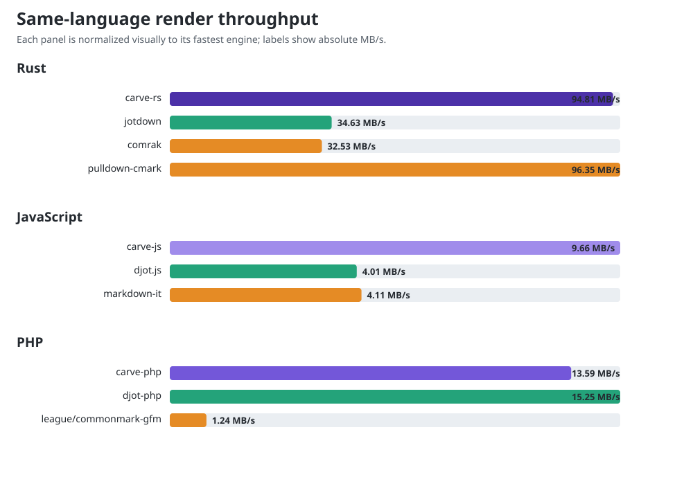
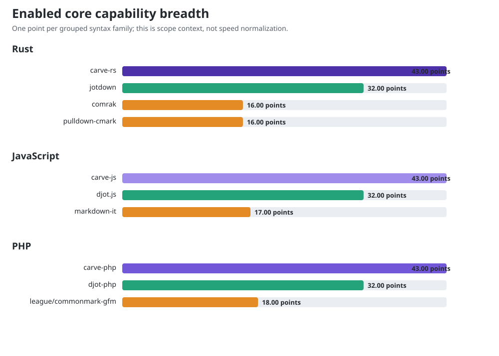

# Benchmark results: fastest public Tier-1 source-to-HTML

This is **Track A**, the competitor-facing view. Each engine uses its normal
fastest public source-to-HTML route with default/core configuration. For Carve,
that deliberately includes the conservative borrowed facade where it accepts
the input. It answers the common conversion-API question; it is not a claim
that every row builds an equivalent owned AST or supports equivalent syntax.

For **Track B**, normal authoritative/full-parser scaling on the mixed Carve
corpus plus the PHP Tier 1/2/3 diagnostic, see [`RESULTS.md`](./RESULTS.md).

Parse + render to HTML, in-process. Each result is the fastest of five warmed
trials; every trial runs the iteration count shown. Inputs carry equivalent
logical content in native Carve, Djot, or Markdown syntax and are 48.1–48.4 KiB.
The libraries do not have identical feature sets or output, so this compares
rendering cost for representative documents—not semantic equivalence.

Do not compare a Track-A Carve number directly with a Track-B number: the first
may render borrowed source slices, while the second materializes the public AST
and runs the full semantic pipeline.

See [`COMPETITOR_ARCHITECTURE.md`](./COMPETITOR_ARCHITECTURE.md) for a
source-checked explanation of the per-library gaps and which architectural
ideas Carve can realistically adopt.

Locked comparison versions: djot.js 0.3.2, markdown-it 15.0.0, djot-php
0.1.32, league/commonmark 2.10.0, jotdown 0.10.0, comrak 0.54.0, and
pulldown-cmark 0.13.4. The checked snapshot used Carve engine heads
carve-js `e4ca018b`, carve-php `3592b1e2`, carve-rs `52c9fe35` on
Linux 7.0, Node.js 22.22.2, PHP 8.5.9 tracing JIT, and rustc 1.97.1.

Every configured engine earns the same 18 workload points. Core capability
points separately expose the much wider syntax surface an engine recognizes
by default. See `FEATURES.md` for the auditable matrix and limitations.

## Rust

| Engine | Workload points | Core capability points | MB/s | Breadth index | vs Carve | trials × iterations |
|---|---:|---:|---:|---:|---:|---:|
| carve-rs | 18 | 43 | 76.31 | 3281.3 | 1.00x | 5 × 200 |
| jotdown | 18 | 32 | 35.51 | 1136.3 | 0.47x | 5 × 200 |
| comrak | 18 | 16 | 30.48 | 487.7 | 0.40x | 5 × 200 |
| pulldown-cmark | 18 | 16 | 95.67 | 1530.7 | 1.25x | 5 × 200 |

## JavaScript

| Engine | Workload points | Core capability points | MB/s | Breadth index | vs Carve | trials × iterations |
|---|---:|---:|---:|---:|---:|---:|
| carve-js | 18 | 43 | 8.99 | 386.7 | 1.00x | 5 × 100 |
| djot.js | 18 | 32 | 3.17 | 101.4 | 0.35x | 5 × 100 |
| markdown-it | 18 | 17 | 3.40 | 57.8 | 0.38x | 5 × 100 |

## PHP

| Engine | Workload points | Core capability points | MB/s | Breadth index | vs Carve | trials × iterations |
|---|---:|---:|---:|---:|---:|---:|
| carve-php | 18 | 43 | 12.63 | 543.2 | 1.00x | 5 × 50 |
| djot-php | 18 | 32 | 1.63 | 52.1 | 0.13x | 5 × 50 |
| league/commonmark-gfm | 18 | 18 | 0.99 | 17.8 | 0.08x | 5 × 50 |

Language groups should be run in isolation. Sustained host load can reduce
absolute throughput substantially even when within-language ordering stays
similar; contaminated groups should be rerun rather than published.
