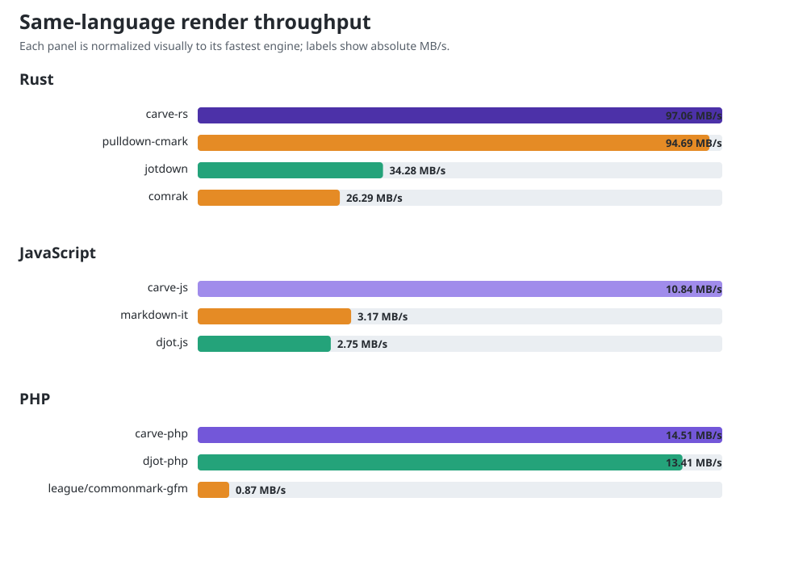
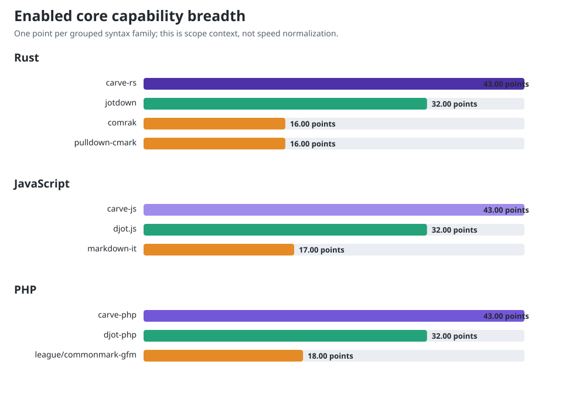

# Benchmark results: core source-to-HTML vs same-language peers

This is **Track A**, the competitor-facing view, and the primary number: every
engine uses its normal fastest public source-to-HTML route in its default core
configuration, with no opt-in extensions registered. For Carve,
that deliberately includes the conservative borrowed facade where it accepts
the input. It answers the common conversion-API question; it is not a claim
that every row builds an equivalent owned AST or supports equivalent syntax.

For **Track B**, normal authoritative/full-parser scaling on the mixed Carve
corpus plus the PHP Tier 1/2/3 diagnostic, see [`RESULTS.md`](./RESULTS.md).

Parse + render to HTML, in-process. Each result is the fastest of five warmed
trials; every trial runs the iteration count shown. Inputs carry equivalent
logical content in native Carve, Djot, or Markdown syntax and are 48.1–48.4 KiB.
The libraries do not have identical feature sets or output, so this compares
rendering cost for representative documents, not semantic equivalence.

Do not compare a Track-A Carve number directly with a Track-B number: the first
may render borrowed source slices, while the second materializes the public AST
and runs the full semantic pipeline.

See [`COMPETITOR_ARCHITECTURE.md`](./COMPETITOR_ARCHITECTURE.md) for the
source-checked reading of each peer's architecture and where each one's
cost sits against Carve's in the same language.

Locked comparison versions: djot.js 0.3.2, markdown-it 15.0.0, djot-php
dev-master (`77e5b6c8`), league/commonmark 2.10.0, jotdown 0.10.0,
comrak 0.54.0, and pulldown-cmark 0.13.4. The Carve engines this run
actually loaded, as each harness reported them back, were
carve-js `@markup-carve/carve 0.1.16 (local checkout carve-js-main @ efef22ad)`, carve-php `markup-carve/carve-php (local checkout carve-php-main @ 32d48beb)`, carve-rs `carve-lang 0.1.14 (local checkout carve-rs-main @ 615e884e)`, measured
2026-11-12 UTC on Linux 7.0.0, Node.js 22.22.2, PHP 8.5.12 tracing JIT, and rustc 1.97.1.

One-minute host load was 11.47 at start and 12.28 at end. CPU affinity does not reserve a core. These shared-host observations do not isolate code speedups.

[Raw samples and producer hashes](reports/main-comparison-20261112.json).

Every configured engine earns the same 18 workload points. Core capability
points separately expose the much wider syntax surface an engine recognizes
by default. See `FEATURES.md` for the auditable matrix and limitations.

## Headline: core route vs the fastest same-language peer

| Language | Carve | MB/s | Fastest peer | MB/s | Carve vs peer |
|---|---|---:|---|---:|---:|
| Rust | carve-rs | 97.06 | pulldown-cmark | 94.69 | 1.03x |
| JavaScript | carve-js | 10.84 | markdown-it | 3.17 | 3.42x |
| PHP | carve-php | 14.51 | djot-php | 13.41 | 1.08x |

Every row above is the default core route with no opt-in extensions registered.
The per-language tables below add each remaining peer and the capability breadth
each engine recognizes in that same configuration.

## The three Carve engines on the same document

| Engine | Language | ms/op | MB/s | rel |
|---|---|---:|---:|---:|
| carve-js | JavaScript | 4.3341 | 10.84 | 8.95x |
| carve-php | PHP | 3.2385 | 14.51 | 6.69x |
| carve-rs | Rust | 0.4841 | 97.06 | 1.00x |

Same input, same core route, so this is the direct cross-language cost of the
implementation rather than of the language surface. Full-corpus scaling for the
pinned merged-main snapshots is in [`RESULTS.md`](./RESULTS.md).

## Rust

| Engine | Workload points | Core capability points | MB/s | Breadth index | vs Carve | trials × iterations |
|---|---:|---:|---:|---:|---:|---:|
| carve-rs | 18 | 43 | 97.06 | 4173.6 | 1.00x | 5 × 200 |
| jotdown | 18 | 32 | 34.28 | 1097.0 | 0.35x | 5 × 200 |
| comrak | 18 | 16 | 26.29 | 420.6 | 0.27x | 5 × 200 |
| pulldown-cmark | 18 | 16 | 94.69 | 1515.0 | 0.98x | 5 × 200 |

## JavaScript

| Engine | Workload points | Core capability points | MB/s | Breadth index | vs Carve | trials × iterations |
|---|---:|---:|---:|---:|---:|---:|
| carve-js | 18 | 43 | 10.84 | 466.2 | 1.00x | 5 × 100 |
| djot.js | 18 | 32 | 2.75 | 88.0 | 0.25x | 5 × 100 |
| markdown-it | 18 | 17 | 3.17 | 53.9 | 0.29x | 5 × 100 |

## PHP

| Engine | Workload points | Core capability points | MB/s | Breadth index | vs Carve | trials × iterations |
|---|---:|---:|---:|---:|---:|---:|
| carve-php | 18 | 43 | 14.51 | 623.9 | 1.00x | 5 × 50 |
| djot-php | 18 | 32 | 13.41 | 429.2 | 0.92x | 5 × 50 |
| league/commonmark-gfm | 18 | 18 | 0.87 | 15.7 | 0.06x | 5 × 50 |

Language groups should be run in isolation. Sustained host load can reduce
absolute throughput substantially even when within-language ordering stays
similar; contaminated groups should be rerun rather than published.
