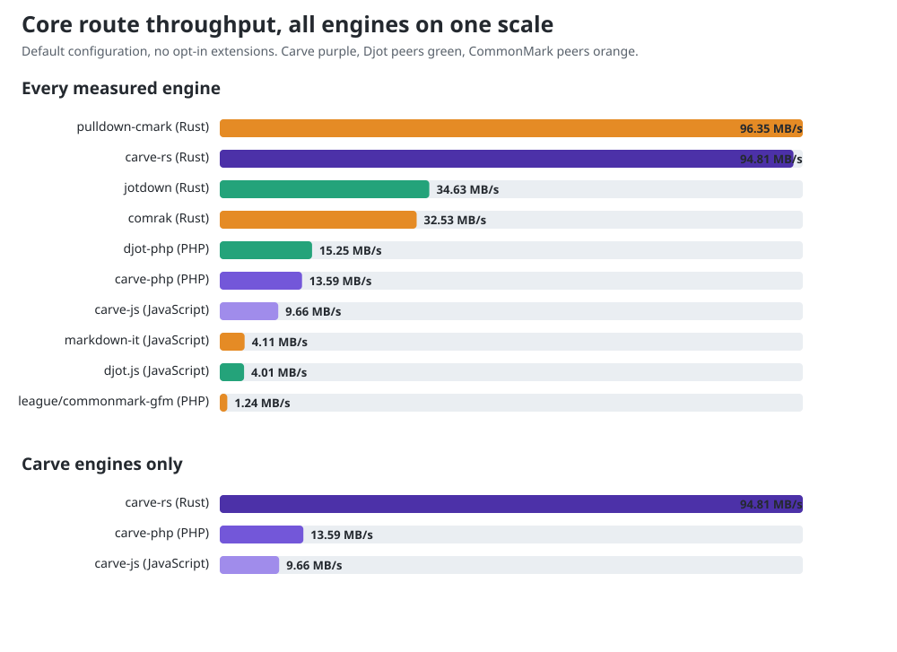

# carve-bench

Performance benchmarks for the [Carve](https://github.com/markup-carve/carve)
markup engines. Each engine renders the same documents to HTML in-process, many
times, and reports throughput. This is a **speed** comparison - every engine
passes the same [conformance corpus](https://github.com/markup-carve/carve/tree/main/tests/corpus),
so correctness is not what is being measured here.

Engines covered: [carve-js](https://github.com/markup-carve/carve-js) (TypeScript),
[carve-php](https://github.com/markup-carve/carve-php) (PHP),
[carve-rs](https://github.com/markup-carve/carve-rs) (Rust). The carve-go /
carve-py / carve-rb bindings wrap the carve-rs engine, so their core render speed
tracks carve-rs plus a thin FFI/IPC layer.

## Results

The headline question is the core route: the default conversion API with **no
opt-in extensions registered**, against the fastest same-language peer.

| Language | Carve | MB/s | Fastest peer | MB/s | Carve vs peer |
|---|---|---:|---|---:|---:|
| Rust | carve-rs | 113.80 | pulldown-cmark | 126.62 | 0.90x |
| JavaScript | carve-js | 11.81 | markdown-it | 5.05 | 2.34x |
| PHP | carve-php | 18.41 | djot-php | 4.07 | 4.52x |



The same core route, Carve engine against Carve engine on the identical
document:

| Engine | Language | ms/op | MB/s | rel |
|---|---|---:|---:|---:|
| carve-js | JavaScript | 3.9791 | 11.81 | 9.64x |
| carve-php | PHP | 2.5528 | 18.41 | 6.18x |
| carve-rs | Rust | 0.4129 | 113.80 | 1.00x |

Every peer row, the capability breadth behind each row, and the method are in
[COMPARISON.md](./COMPARISON.md).

The published numbers are deliberately split into two tracks:

| Track | Question | Route | Peers |
|---|---|---|---|
| A: [core source-to-HTML](./COMPARISON.md) | How fast is the normal core conversion API? | Default configuration, borrowed facade where accepted | Same-language Djot/CommonMark libraries |
| B: [full corpus and configured tiers](./RESULTS.md) | How does the whole language scale, and what do opt-in extensions cost? | Mixed 1,325-document corpus plus PHP Tier 1/2/3 | Carve implementations and internal tiers |

Track A and Track B are not interchangeable. A Track-A library may avoid an
owned public AST; Track B intentionally measures the cost that facade hides.
Competitors are absent from the full Carve corpus because they do not implement
equivalent syntax there, so such rows would measure literal/error recovery
rather than equal work.

Every table in both documents is regenerated by `compare.mjs` / `run.mjs`; no
row is transcribed by hand, including the PHP tier table.

**Reproducing the Carve rows needs engine checkouts, not the published
packages.** The npm and Packagist releases lag the engine heads the tables name:
measured on 2026-08-21, npm `@markup-carve/carve` 0.1.4 rendered the comparison
document at 1.99 MB/s against 11.81 MB/s for carve-js `main`, and Packagist
`markup-carve/carve-php` 0.1.5 does not contain the borrowed facade at all. Set
`CARVE_JS` / `CARVE_PHP_AUTOLOAD` / the cargo `patch` at the heads listed in
`COMPARISON.md` before comparing against a published number.

Measured hotspots and optimization candidates are in [FINDINGS.md](./FINDINGS.md). The
comparison's auditable workload scoring is in [FEATURES.md](./FEATURES.md).
The follow-up architecture prototypes and costed recommendations are in
[ARCHITECTURE.md](./ARCHITECTURE.md).
Numbers are machine- and version-specific - run them yourself; treat them as
relative, not absolute.

## Documents

`corpus/` holds three sizes built from the spec corpus: `small` (~1 KB),
`medium` (~13 KB, the whole corpus concatenated) and `large` (~100 KB, the
corpus repeated). Regenerate from a local carve checkout:

```bash
CARVE_REPO=../carve node scripts/gen-corpus.mjs
```

## Running

Each engine has a small harness under `engines/` that takes `<doc> <iters>` and
prints one JSON line (`ms_per_op`, `mb_per_s`). `run.mjs` runs every engine over
every document and writes `RESULTS.md`.

```bash
# 1. Build the Rust harness (release):
(cd engines/rs && cargo build --release)

# 2. Make the JS and PHP engines resolvable (see "Engine resolution").

# 3. Run:
node run.mjs              # full run
node run.mjs --quick      # few iterations, to smoke-test the harness
```

For a publication run, use a clean PHP INI so a globally loaded coverage or
debug extension cannot disable JIT, and record the selected revisions in the
generated report:

```bash
CARVE_PHP_INI='-n -d extension=ctype -d extension=mbstring' \
CARVE_RUN_META='YYYY-MM-DD on HOST; Node X, PHP Y tracing JIT, rustc Z.' \
CARVE_ENGINE_HEADS='carve-js `REV`, carve-php `REV`, carve-rs `REV`.' \
CARVE_CORPUS_SNAPSHOT='carve `REV` (N documents).' \
node run.mjs
```

Accept the PHP rows only when every harness line reports `jit=true`.

For the same-language comparison, install the locked dependencies in each
engine directory, build both Rust binaries, generate the comparison corpus,
then run:

```bash
node scripts/gen-comparison-corpus.mjs
(cd engines/js && npm ci)
(cd engines/php && composer install)
(cd engines/rs && cargo build --release)
CARVE_JS=../carve-js/dist/index.js CARVE_PHP_SRC=../carve-php/src node compare.mjs
node scripts/gen-charts.mjs
```

`compare.mjs` runs PHP with `-n`, so it loads `ctype` and `mbstring` explicitly;
carve-php calls `ctype_alnum`, and a build where ctype is a shared extension
fatals without that flag.

`compare.mjs` implements the documented 48 KiB, warm, min-of-five method. It
uses equivalent native syntax for each markup family rather than feeding Carve
syntax to a Markdown parser. Competitor-facing Carve measurements always use
Tier 1/core; Tier 2 and Tier 3 are separate internal diagnostics. Environment
overrides use the same variables as the cross-Carve run, plus
`CARVE_RS_COMPARE_BIN` for the comparison binary.

### Engine resolution

The harnesses resolve each engine via environment variables, so you can point at
a published package or a local checkout:

| Engine    | Env var              | Default                                     |
|-----------|----------------------|---------------------------------------------|
| carve-js  | `CARVE_JS`           | `@markup-carve/carve` (the npm package)      |
| carve-php | `CARVE_PHP_AUTOLOAD` | `engines/php/vendor/autoload.php`           |
| carve-php | `CARVE_PHP_SRC`      | unset - a checkout's `src/`, prepended       |
| carve-rs  | `CARVE_RS_BIN`       | `engines/rs/target/release/carve-bench-rs`  |

Prefer `CARVE_PHP_SRC` for a checkout. `CARVE_PHP_AUTOLOAD` alone cannot beat the
benchmark's own vendored carve-php: Composer prepends that loader, so it resolves
`MarkupCarve\Carve\*` first and the checkout never runs. `CARVE_PHP_SRC` rewrites
the PSR-4 prefix instead and works against a bare worktree with no `vendor/`.

Example, all three from local checkouts beside this repo:

```bash
export CARVE_JS=../carve-js/dist/index.js
export CARVE_PHP_AUTOLOAD=../carve-php/vendor/autoload.php
# engines/rs deps on carve-rs by git; to build against a local checkout instead:
(cd engines/rs && cargo build --release \
  --config 'patch."https://github.com/markup-carve/carve-rs".carve-lang.path="../../../carve-rs"')
node run.mjs
```

For the PHP extension-stack measurement, use a clean INI so a loaded coverage
extension cannot disable JIT silently:

```bash
for profile in tier1 tier2 tier3; do
  php -n -d extension=mbstring -d opcache.enable_cli=1 \
    -d opcache.jit=tracing -d opcache.jit_buffer_size=128M \
    engines/php/tiers.php "$profile" corpus/comparison/carve.crv 5 5
done
```

Here `tier3` means Tier 1 + every Tier-2 extension + the reproducible
zero-configuration Tier-3 bundle listed in `FINDINGS.md`; the specification has
no canonical all-Tier-3 profile because app extensions can require host data or
callbacks.

`COMPARISON.md` reports both portable-workload points and the substantially
broader core capability points enabled in each exact configuration. The latter
make parser scope visible but are not a speed-normalization divisor; see
`FEATURES.md`.

## Method notes

- Timing is **in-process** (no per-render process startup), so it measures
  render throughput, not CLI launch cost.
- Each harness warms up before timing (JIT for JS, opcode cache for PHP).
- `rel` in the results is relative to the fastest engine per document.
- The comparison is parse + render, not parse-only. Feature sets and generated
  HTML differ, so it is a throughput comparison over equivalent representative
  inputs, not an output-equivalence claim.
- The PHP engine is benchmarked with `opcache.enable_cli=1` and `opcache.jit=tracing`
  so it reflects production PHP performance. **Coverage/debug extensions (xdebug, pcov)
  must be disabled** before benchmarking PHP - they override `zend_execute_ex`, which
  disables JIT and inflates timings by roughly 2x. The harness warns on stderr if
  either is detected or JIT is not active.
- PHP JSON results include `carve_source`. When `CARVE_PHP_AUTOLOAD` selects a
  checkout, verify this path before accepting a comparison; this guards against
  Composer autoloader precedence silently benchmarking the vendored release.
