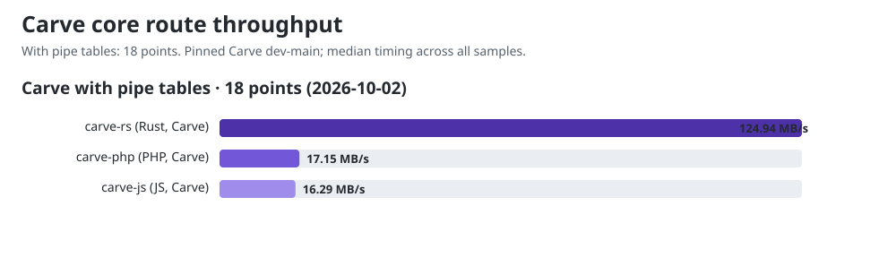

# carve-bench

Performance benchmarks for the [Carve](https://github.com/markup-carve/carve)
markup engines. Each engine renders the same documents to HTML in-process, many
times, and reports throughput. This is a **speed** comparison - every engine
passes the same [conformance corpus](https://github.com/markup-carve/carve/tree/main/tests/corpus),
so correctness is not what is being measured here.

Engines covered: [carve-js](https://github.com/markup-carve/carve-js) (TypeScript),
[carve-php](https://github.com/markup-carve/carve-php) (PHP),
[carve-rs](https://github.com/markup-carve/carve-rs) (Rust). The carve-go /
carve-py / carve-rb bindings wrap the carve-rs engine, so their core render speed
tracks carve-rs plus a thin FFI/IPC layer.

## JavaScript comparison including commonmark.js

The [shared JavaScript core report](reports/commonmark-js.md) compares Carve,
Djot, markdown-it and commonmark.js 0.31.2 on equivalent content without pipe tables.
Its runner checks projected HTML before timing and records two reversed-order rounds,
plus a CommonMark parser/renderer constructor control. This 14-point workload
is separate from the 18-point comparison with pipe tables below.
The all-engines chart shows final values in a separate panel without pipe tables; the
interactive site view also includes commonmark.js under All languages and JavaScript.
Final values use median timing across all samples from both rounds. The raw
report retains the individual rounds. Different content mixes change each library's conversion cost. Compare within each workload; engine versions and commits are recorded in the report.

The current comparison measures Carve JS merged main `05778b2` against released
peers. The [0.1.9 snapshot](reports/commonmark-js-release-0.1.9.md)
remains available. To reproduce merged main, use the pinned checkout command
in the report; the runner verifies its ancestry, clean source and fast-path use.

Run `npm ci` in `engines/js`, then `node scripts/compare-commonmark.mjs`
from the repository root. Generate its chart with `node scripts/gen-charts.mjs`.

## Results

The [**benchmark site**](https://markup-carve.github.io/carve-bench/) presents the
same reports with language filters and downloadable charts. See the
[site build instructions](site/README.md) to reproduce it locally.

The throughput charts use pinned Carve development main for JS, PHP and Rust,
measured 2026-10-04 Europe/Berlin. See [the source commits and samples](reports/dev-main-core.md).
The current tables below use median timing across fourteen samples.
The shared host's one-minute load average changed from 7.19 to 8.01 during the core run. Raw rounds retain timing spread; comparisons with previous snapshots do not isolate code changes.
The PHP peer now uses Djot master `c770502` in place of the August
`fab953f` snapshot. Exact sources are recorded in the report.
Historical release results remain in [COMPARISON.md](COMPARISON.md).
The September 30 development-main snapshot, taken after the PHP
parser and renderer changes and naming its exact commits and input hashes, is in
[the refresh report](reports/performance-refresh.md).

The table below records the core route: the default conversion API with **no
opt-in extensions registered**, against the fastest same-language peer.

| Language | Carve | MB/s | Fastest peer | MB/s | Carve vs peer |
|---|---|---:|---|---:|---:|
| Rust | carve-rs | 85.05 | pulldown-cmark | 88.20 | 0.96x |
| JavaScript | carve-js | 13.20 | djot.js | 4.96 | 2.66x |
| PHP | carve-php | 12.82 | djot-php | 15.38 | 0.83x |




Carve development-main engines on the identical document:

| Engine | Language | ms/op | MB/s | rel |
|---|---|---:|---:|---:|
| carve-js | JavaScript | 4.5246 | 13.20 | 6.44x |
| carve-php | PHP | 4.6593 | 12.82 | 6.63x |
| carve-rs | Rust | 0.7023 | 85.05 | 1.00x |

Current peer rows and measurement details are in [the dev-main report](reports/dev-main-core.md).
Historical release rows and capability scoring remain in [COMPARISON.md](./COMPARISON.md).

The published numbers are deliberately split into two tracks:

| Track | Question | Route | Peers |
|---|---|---|---|
| A: [core source-to-HTML](reports/dev-main-core.md) | How fast is the normal core conversion API? | Default configuration, borrowed facade where accepted | Same-language Djot/CommonMark libraries |
| B: [full corpus and configured tiers](./RESULTS.md) | How does the whole language scale, and what do opt-in extensions cost? | Mixed 2,134-document corpus plus PHP Tier 1/2/3 | Carve implementations and internal tiers |

Track A and Track B are not interchangeable. A Track-A library may avoid an
owned public AST; Track B intentionally measures the cost that facade hides.
Competitors are absent from the full Carve corpus because they do not implement
equivalent syntax there, so such rows would measure literal/error recovery
rather than equal work.

Every table in both documents is regenerated by `compare.mjs` / `run.mjs`; no
row is transcribed by hand, including the PHP tier table.

The historical `COMPARISON.md` tables measure the pinned published releases.
The current `RESULTS.md` tables measure the same merged main commits as the core
report, using runtime checkout overrides. The [full-run record](reports/dev-main-full.json)
contains worker results, source commits, input hashes and runtime settings.

To reproduce the current full-corpus snapshot, check out the commits named in
[the core report](reports/dev-main-core.md), build Carve JS, and build the Rust
worker with `node scripts/build-rs-engine.mjs --carve-rs /tmp/carve-rs-main`.
Then run serially with the checkout overrides:

```sh
CARVE_JS=/tmp/carve-js-main/dist/index.js \
CARVE_PHP_SRC=/tmp/carve-php-main/src \
CARVE_RS_SRC=/tmp/carve-rs-main \
CARVE_PHP_INI="-n -d extension=ctype -d extension=mbstring" \
CARVE_FULL_REPORT=reports/dev-main-full.json \
node run.mjs
node scripts/gen-charts.mjs
```

Report freshness checks require a new measurement after changing the recorded
measurement code or dependency locks.

The runners record the process CPU affinity. Headline and full-corpus snapshots
allow the available CPUs so Node compiler and GC threads can run concurrently.
New history main points use CPU 13. Retained release-tag samples used CPU 12;
the report records both measurement sessions.

The mixed corpus produces different HTML on published releases and current
main. See the [output checks and paired Rust control](reports/dev-main-full-output-controls.json)
before interpreting cross-version full-corpus timings as speed changes.


The historical [PHP snapshot check](docs/php-snapshot-check.md) compares two
pre-improvement commits with identical PHP source trees. It does not cover the
parser and renderer changes measured here.

To reproduce the current throughput tables, use [the pinned main runner](reports/dev-main-core.md#reproduce).
The 150-section fixture differs from the historical release workload; peer speed
and Carve ratios can change with the content mix.

To reproduce historical release tables, install the pinned releases and generate the
corpus from the carve commit the reports name:

| Component | Version |
|---|---|
| carve (corpus) | `9db91206d1a4a8a8cf795c48210bca49d66f14d6` |
| carve-js | npm `@markup-carve/carve` 0.1.9 |
| carve-php | Composer `markup-carve/carve-php` 0.1.10 |
| carve-rs | crates.io `carve-lang` 0.1.7 |

Build carve-js with `npm ci`, install the benchmark's locked JS/PHP dependencies,
and use the checkout commands under "Engine resolution" to build and run Rust.
Regenerate the corpus with `CARVE_REPO`, run `compare.mjs` and `run.mjs` with
all three engine overrides, then regenerate charts with
`node scripts/gen-charts.mjs`.

Measured hotspots and optimization candidates are in [FINDINGS.md](./FINDINGS.md). The
comparison's auditable workload scoring is in [FEATURES.md](./FEATURES.md).
The follow-up architecture prototypes and costed recommendations are in
[ARCHITECTURE.md](./ARCHITECTURE.md).
Numbers are machine- and version-specific - run them yourself; treat them as
relative, not absolute.

## Documents

`corpus/` holds three sizes built from the spec corpus: `small` (~1 KB),
`medium` (~64 KB, the whole corpus concatenated) and `large` (~509 KB, the
corpus repeated). Regenerate from a local carve checkout:

```bash
CARVE_REPO=../carve node scripts/gen-corpus.mjs
```

## Running

Each engine has a small harness under `engines/` that takes `<doc> <iters>` and
prints one JSON line (`ms_per_op`, `mb_per_s`). `run.mjs` runs every engine over
every document and writes `RESULTS.md`.

```bash
# 1. Build the Rust harness (release):
node scripts/build-rs-engine.mjs

# 2. Make the JS and PHP engines resolvable (see "Engine resolution").

# 3. Run:
node run.mjs              # full run
node run.mjs --quick      # few iterations, to smoke-test the harness
```

For a publication run, use a clean PHP INI so a globally loaded coverage or
debug extension cannot disable JIT:

```bash
CARVE_PHP_INI='-n -d extension=ctype -d extension=mbstring' \
CARVE_RUN_META='YYYY-MM-DD on HOST; Node X, PHP Y tracing JIT, rustc Z.' \
CARVE_CORPUS_SNAPSHOT='carve `REV` (N documents).' \
node run.mjs
```

Set `CARVE_SMALL_INPUT_UNSTABLE=1` when reproducing the September 30 snapshot
to retain its small-input warning. For a new snapshot, assess instability from
its own repeated runs and diagnostics before setting the flag.

The engine line is not among those: each harness reports the engine it
resolved and the report is written from what came back, so it cannot name a
revision the run did not use. See "Engine pinning and provenance".

Accept the PHP rows only when every harness line reports `jit=true`.

For the same-language comparison, install the locked dependencies in each
engine directory, build both Rust binaries, generate the comparison corpus,
then run:

```bash
node scripts/gen-comparison-corpus.mjs
(cd engines/js && npm ci)
(cd engines/php && composer install)
node scripts/build-rs-engine.mjs
CARVE_JS=../../../carve-js/dist/index.js CARVE_PHP_SRC=../carve-php/src node compare.mjs
node scripts/gen-charts.mjs
```

`compare.mjs` runs PHP with `-n`, so it loads `ctype` and `mbstring` explicitly;
carve-php calls `ctype_alnum`, and a build where ctype is a shared extension
fatals without that flag.

`compare.mjs` implements the documented 48 KiB, warm, min-of-five method. It
uses equivalent native syntax for each markup family rather than feeding Carve
syntax to a Markdown parser. Competitor-facing Carve measurements always use
Tier 1/core; Tier 2 and Tier 3 are separate internal diagnostics. Environment
overrides use the same variables as the cross-Carve run, plus
`CARVE_RS_COMPARE_BIN` for the comparison binary.

### Engine resolution

The harnesses resolve each engine via environment variables, so you can point at
a published package or a local checkout:

| Engine    | Env var              | Default                                     |
|-----------|----------------------|---------------------------------------------|
| carve-js  | `CARVE_JS`           | `@markup-carve/carve` (the npm package)      |
| carve-php | `CARVE_PHP_AUTOLOAD` | `engines/php/vendor/autoload.php`           |
| carve-php | `CARVE_PHP_SRC`      | unset - a checkout's `src/`, prepended       |
| carve-rs  | `CARVE_RS_SRC`       | unset - a carve-rs checkout to measure       |
| carve-rs  | `CARVE_RS_BIN`       | the harness built for whichever of the two above |

Every harness reports what it resolved as `carve_source` in its JSON line, and
`run.mjs` / `compare.mjs` write the report's engine line from those values.

A relative path is resolved by whatever consumes it, and that differs per lane.
`CARVE_JS` is an import specifier inside `engines/js/`, so a checkout beside this
repo is `../../../carve-js/dist/index.js`; `CARVE_PHP_SRC` and `CARVE_RS_SRC` are
read where you started the run, so the same checkout is `../carve-php/src` and
`../carve-rs`. An absolute path sidesteps the asymmetry.

**Naming a checkout is a claim, and the run checks it.** When `CARVE_JS`,
`CARVE_PHP_SRC` or `CARVE_RS_SRC` names a tree, `run.mjs` and `compare.mjs`
compare the reported `carve_source` against it and exit without writing a report
if the run measured anything else - the published release, a different checkout,
or a lane that reported nothing at all. `node scripts/test-measured-sources.mjs`
is that check being made to fire on each of those readings.

An absolute override is fine to pass, and it does not reach the committed
reports: a report records the interpreter by name, a path inside this repo
relative to its root, and anything outside it by file name. Reports are
published, so `node --test scripts/test-host-paths.mjs` fails the suite when a
tracked file names a home directory.

Prefer `CARVE_PHP_SRC` for a checkout. `CARVE_PHP_AUTOLOAD` alone cannot beat the
benchmark's own vendored carve-php: Composer prepends that loader, so it resolves
`MarkupCarve\Carve\*` first and the checkout never runs. `CARVE_PHP_SRC` rewrites
the PSR-4 prefix instead and works against a bare worktree with no `vendor/`.

Example, all three from local checkouts beside this repo:

```bash
export CARVE_JS=../../../carve-js/dist/index.js
export CARVE_PHP_SRC=../carve-php/src
export CARVE_RS_SRC=../carve-rs
# The Rust lane is compiled, so the checkout needs a build of its own:
node scripts/build-rs-engine.mjs --carve-rs "$CARVE_RS_SRC"
node run.mjs
```

The Rust harness for a checkout is built from a generated manifest under
`engines/rs/target/local-override/`, whose carve dependency is a path with no
version requirement; `run.mjs` and `compare.mjs` pick that binary up from
`CARVE_RS_SRC`, so there is no second path to keep in step. Pass `--debug` to
check provenance without paying for an optimized build.

A path dependency rather than a `[patch]`, because cargo refuses a patch whose
version does not satisfy the requirement, or that disagrees with the lockfile,
and it refuses by warning and exiting 0. Any override that has to match the
pinned version therefore stops applying the moment carve-rs releases past the
pin, and builds the published crate instead while reading like a checkout run. A
path dependency has no version to match. `build-rs-engine.mjs` also reads the
resolution before it compiles and the built binary afterward, so a patch left in
a cargo config cannot substitute an engine either.

### Engine pinning and provenance

Comparability is what this repo produces, so every lane names one exact
published release of its engine and none of them can move without a tracked
manifest line changing:

| Lane | Manifest | Requirement |
|---|---|---|
| carve-js | `engines/js/package.json` | `0.1.9` - npm is exact without a range operator |
| carve-php | `engines/php/composer.json` | `0.1.10` - Composer is exact without a range operator |
| carve-rs | `engines/rs/Cargo.toml` | `=0.1.7` - the `=` matters, a bare version is a caret range in Cargo |

To move a lane onto a newer engine release, edit that requirement and refresh
the lockfile beside it (`npm install`, `composer update markup-carve/carve-php`,
`cargo update -p carve-lang`), then re-run the benchmarks: a table mixing
engine revisions is not a comparison. Measuring an unreleased engine is an
override at run time, not an edit to these manifests - and the Rust pin stays
exact for that reason rather than being widened to let an override through. A
range would let a checkout satisfy it, but the lockfile pins the release as well,
so widening the requirement moves the silent fallback rather than removing it.

The table above is prose and drifts silently, so it is checked rather than
trusted. `node scripts/check-engine-pins.mjs` compares all four places that name
a release - the manifest, the lockfile, the installed tree, and this table - and
fails on any disagreement. The smoke workflow runs it with `--require-installed`
after the three install steps, so it reads what is on disk: a requirement bumped
without a reinstall does not pass.

That check compares the repo against itself, so a set of pins can agree in all
four places and still name a release the registries superseded weeks ago - which
is how the tables twice came to describe engines nobody installs any more.
`node scripts/check-pin-freshness.mjs` asks each registry for its newest stable
release instead. The daily `pin freshness` workflow runs it and keeps one
tracking issue open while a pin is behind; the run itself stays green once that
issue is filed, and goes red only when the check cannot reach a verdict. A failure is not a defect in the
tables; it means the pinned engine is old, and the fix is a bump **plus** a re-run of both tracks. A bump alone publishes the previous
engine's numbers under the new version's name.

The report says which of the two happened. Each harness resolves its engine,
reports it as `carve_source`, and the generated documents name it - a
published release by version and package checksum or reference, a checkout by
path and revision. An engine that reports nothing is written as `unreported`
rather than omitted, and one that resolves two different sources within a
single run is written as a `MISMATCH`, because neither run is comparable and
the report is where that has to be visible. An override is stricter than that:
when one named the tree, a run that measured another writes no report at all,
rather than a correct engine line a reader has to catch.

For the PHP extension-stack measurement, use a clean INI so a loaded coverage
extension cannot disable JIT silently:

```bash
for profile in tier1 tier2 tier3; do
  php -n -d extension=mbstring -d opcache.enable_cli=1 \
    -d opcache.jit=tracing -d opcache.jit_buffer_size=128M \
    engines/php/tiers.php "$profile" corpus/comparison/carve.crv 5 5
done
```

Here `tier3` means Tier 1 + every Tier-2 extension + the reproducible
zero-configuration Tier-3 bundle listed in `FINDINGS.md`; the specification has
no canonical all-Tier-3 profile because app extensions can require host data or
callbacks.

`COMPARISON.md` reports both portable-workload points and the substantially
broader core capability points enabled in each exact configuration. The latter
make parser scope visible but are not a speed-normalization divisor; see
`FEATURES.md`.

## Method notes

- Timing is **in-process** (no per-render process startup), so it measures
  render throughput, not CLI launch cost.
- Each harness warms up before timing (JIT for JS, opcode cache for PHP).
- `rel` in the results is relative to the fastest engine per document.
- The comparison is parse + render, not parse-only. Feature sets and generated
  HTML differ, so it is a throughput comparison over equivalent representative
  inputs, not an output-equivalence claim.
- The PHP engine is benchmarked with `opcache.enable_cli=1` and `opcache.jit=tracing`
  so it reflects production PHP performance. **Coverage/debug extensions (xdebug, pcov)
  must be disabled** before benchmarking PHP - they override `zend_execute_ex`, which
  disables JIT and inflates timings by roughly 2x. The harness warns on stderr if
  either is detected or JIT is not active.
- Every harness's JSON includes `carve_source`, the engine it actually
  resolved. A run that named a tree verifies it for you; verify it by eye for a
  run that did not. In PHP this also guards against Composer autoloader
  precedence silently benchmarking the vendored release instead of the checkout
  `CARVE_PHP_SRC` names, and in Rust against a build that resolved the published
  crate while an override asked for a checkout.

## Engine release history

The separate history track measures the latest four stable Git tags for each
engine, followed by a pinned development main. It belongs here; correctness
and conformance evidence belongs in carve-proofs. The graph marks changed HTML
output because timings across a behavior change can represent different work.

```bash
python3 scripts/history/run.py --cpu 13 --rounds 4 --samples 11
```

Omit `--cpu` when affinity is unavailable, or select a CPU allowed on your host.
Requires Python 3.11+, Git, Node/npm, PHP/Composer and Rust/Cargo on a POSIX host.
The first run downloads source snapshots and builds each revision. Later runs
reuse an ignored `.history-cache/`. Engine repositories and the pinned headline
manifests stay untouched. Four tags plus a differing main means at most fifteen
engine builds; measurement cost scales with revisions, cases and sample count.
Source snapshots and saved binaries stay in that cache; shared Rust compilation
artifacts live under `/tmp/cargo-shared/carve-bench-history`. The caches can be
removed to reclaim their disk space.

The runner fetches tags and main once, sorts stable semantic versions, and
records exact source commits. A main with identical parser source, resources
and dependency/build manifests to the latest tag reuses its graph point.
Documentation-only changes do not require another measurement. Each revision
uses the same generated fixtures and runtime within its engine. The runner defaults to three rounds and seven in-process samples per case and
size. The published snapshot uses four rounds and eleven samples; its main
points were refreshed separately while retaining the release-tag samples.
Rust uses optimized release builds. PHP uses CLI opcache/JIT off and disables
coverage, matching the maintenance investigation rather than the headline
production-JIT benchmark. Node workloads receive at least 500 ms of warm-up with a size-dependent minimum
iteration count.

Results are `reports/engine-history.{json,csv,md,html}` and three standalone SVGs.
Open the HTML for engine, case, size and unit selectors. The default static
charts show time relative to the oldest tag on a logarithmic scale; lower is
faster. Every workload starts at its own 1× baseline, so starting points are
ratios, not equal elapsed times. Legend entries show baseline milliseconds.
Hollow points differ from the oldest output, and lines stop at output
changes. Shared-host load and sample ranges remain visible in the raw JSON.
The site copies these committed results without rerunning benchmarks during
deployment. Refresh them through a PR after running on a suitable host.

For a shorter local check, use `--rounds 1 --samples 3 --sizes 128` and a separate
`--output` path. Concurrent runs also need separate `--cache` directories. `--prepare-only` builds the selected snapshots without timing.
The Rust equivalent-verse control uses invalid reference-definition syntax so
older tags and main retain the same body; the original verse case is also kept
and may produce different output across revisions.

The history signature covers the fixture and measurement functions. Worker hashes and source/build records identify the remaining execution context. Report generation also verifies sample counts, output hashes and summaries against the raw timings.

The [latest main comparison](reports/latest-main-comparison.md) lists current merged main against the two most recent tags for all three engines, with a [CSV export](reports/latest-main-comparison.csv). Published history graphs contain release tags and merged main. Intermediate PR measurements and their controls remain in local evidence artifacts. The [focused runner instructions](scripts/deep-review/README.md) describe how to repeat those cases locally.

The historical [merged main versus PHP and Rust peers](reports/merged-core-peers.md) report includes warmed medians, raw samples, source hashes and matching Carve output hashes.

Release-history graphs show sample ranges; overlapping +100% readings are marked uncertain.
