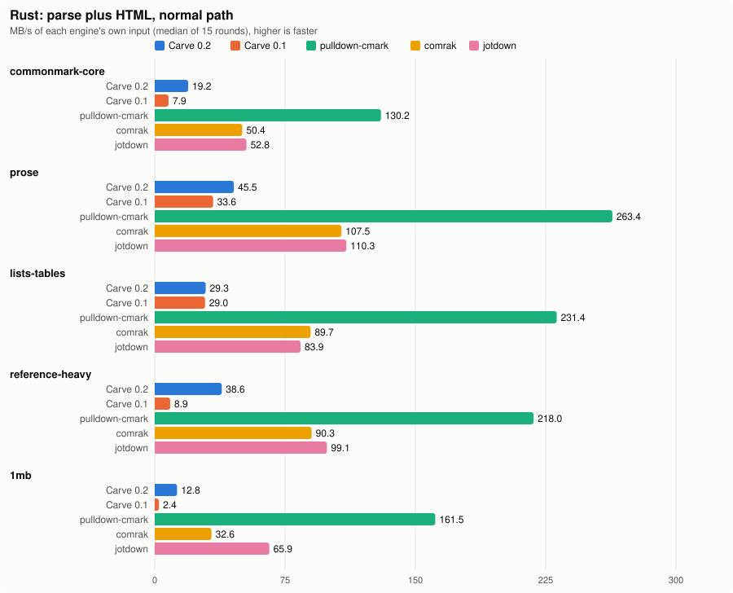
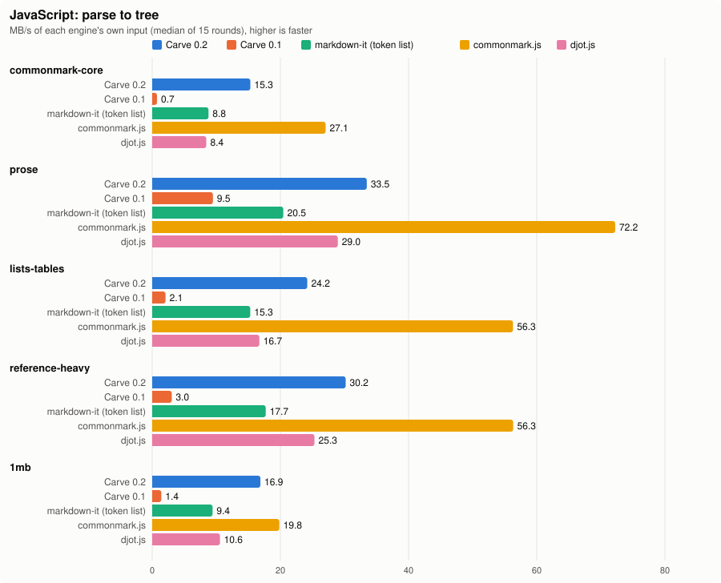

# carve-bench: Carve 0.2 on the normal path

This branch measures the three Carve 0.2 engines against their Carve 0.1 engines and against the
peers of their own language. Every engine takes the normal path: parse the source to the full
tree, then render HTML from that tree. The fast paths of the 0.1 engines, which write HTML without
building a tree, are not measured anywhere on this branch.

The numbers below were **measured under load, to be repeated** on a quiet machine. They are from a
laptop that ran other jobs at the same time (load average in the tables).

## What is measured

| Language | Carve 0.2 | Carve 0.1, tree route | Peers (default configuration) |
|---|---|---|---|
| JavaScript | `parse(src)` and `render(src)` of carve-js `v2/src` | `resolve(parse(src))`, and `renderHtml(resolve(parse(src, { positions })))` | markdown-it, commonmark.js, djot.js |
| Rust | `carve2::parse_resolved` and `carve2::render` | `carve::parse`, and `carve::render_html(&carve::parse(src))` | pulldown-cmark, comrak, jotdown |
| PHP | `Carve2::parse` and `Carve2::toHtml` | `CarveConverter::parse`, and `render(parse(src))` | league/commonmark (GFM converter), php-collective/djot |

Two measures per engine and document: **parse to tree** (source to the tree the engine renders
from) and **parse plus HTML**. Each is given in microseconds per document and in MB/s of the
engine's own input (1 MB = 10^6 bytes). The tables here show MB/s from the median; every median
and minimum in microseconds is in [`results/RESULTS.md`](results/RESULTS.md), every sample in the
JSON files next to it.

Documents (see [`documents/SOURCE.md`](documents/SOURCE.md)): the four document triples of carve-js
`next2`, each in Carve (`.crv`), Markdown (`.md`) and Djot (`.dj`) with the same content, and a
`1mb` document built from their concatenation. Each engine reads its own language.

## How the 0.1 fast paths are avoided

- **JavaScript.** `carveToHtml` first tries `tryFastHtml`, then `tryFastAstDocument` and an internal
  HTML-only parse. The benchmark calls the public `parse`, `resolve` and `renderHtml` instead, none
  of which reaches those functions. For the HTML measure, positions are on only when the source
  holds an image, the rule `carveToHtml` itself applies; the parse measure uses the default
  (positions on), as Carve 0.2's `parse` does.
- **Rust.** `carve::to_html` first tries `try_layout_html`. The benchmark calls `carve::parse` and
  then `carve::render_html(&doc)`, which takes only the tree and has no source to lay out from.
- **PHP.** `CarveConverter::convert` first tries the borrowed HTML layout and hands the source to
  the renderer. The benchmark calls `parse` and then `render($document)`; `render` alone has no
  source, so the renderer takes its tree route.

Each harness proves the route on the input `# Title\n\nHello *world*.\n`, which the JavaScript and
PHP fast paths serve (checked through their internal planners): it parses, edits the first text
node of the tree, renders again, and records that the edit shows in the HTML and that the unedited
HTML equals the engine's one-call output. The records are the `route` fields of the result files.

## Results

<!-- results:start -->

**Measured under load, to be repeated.** Measured 2026-11-15T18:26:37.969Z to 2026-11-15T18:44:18.630Z on AMD Ryzen 9 PRO 7940HS w/ Radeon 780M Graphics (16 threads), Linux 7.0.0-38-generic. v22.22.2, PHP 8.5.12, rustc 1.97.1 (8bab26f4f 2026-07-14). Harness commit `58fdc25a8014ed2701ea4bc008de6e2bd48dcb75`. Engine commits: carve-js `c27a9dd40c1c0a359ebb2f3c3c44edbd0d429ae8`, carve-rs `8c70808759761875a7beba9289eb9c236ceda6e2`, carve-php `a9679962657af56f1b743ba7a1910e279fb935a5`. Load average at start 8.6, 9.27, 7.84, at end 15.95, 11.11, 9.63.

### Parse plus HTML, normal path

| JavaScript: parse plus HTML, MB/s | commonmark-core | prose | lists-tables | reference-heavy | 1mb |
|---|--:|--:|--:|--:|--:|
| Carve 0.2 | 10.2 | 23.8 | 15.9 | 20.2 | 9.9 |
| Carve 0.1 | 0.5 | 4.6 | 1.2 | 1.5 | 0.8 |
| markdown-it | 4.4 | 12.5 | 8.3 | 10.3 | 5.0 |
| commonmark.js | 9.0 | 35.7 | 27.2 | 28.6 | 8.8 |
| djot.js | 3.5 | 14.6 | 8.3 | 12.8 | 4.9 |

| Rust: parse plus HTML, MB/s | commonmark-core | prose | lists-tables | reference-heavy | 1mb |
|---|--:|--:|--:|--:|--:|
| Carve 0.2 | 7.0 | 21.0 | 14.7 | 17.8 | 5.9 |
| Carve 0.1 | 5.5 | 26.7 | 21.7 | 5.9 | 1.9 |
| pulldown-cmark | 102.3 | 216.4 | 186.4 | 163.6 | 122.1 |
| comrak | 38.7 | 84.3 | 68.8 | 66.1 | 26.0 |
| jotdown | 41.1 | 87.9 | 64.8 | 73.5 | 47.4 |

| PHP, JIT off: parse plus HTML, MB/s | commonmark-core | prose | lists-tables | reference-heavy | 1mb |
|---|--:|--:|--:|--:|--:|
| Carve 0.2 | 1.3 | 4.2 | 2.8 | 4.3 | 1.9 |
| Carve 0.1 | 0.2 | 2.1 | 0.7 | 1.1 | 0.2 |
| league/commonmark GFM | 0.9 | 2.6 | 1.6 | 2.3 | 1.2 |
| php-collective/djot | 9.9 | 4.3 | 2.6 | 3.7 | 2.8 |

| PHP, opcache.jit=tracing: parse plus HTML, MB/s | commonmark-core | prose | lists-tables | reference-heavy | 1mb |
|---|--:|--:|--:|--:|--:|
| Carve 0.2 | 1.2 | 4.6 | 2.5 | 4.2 | 1.9 |
| Carve 0.1 | 0.2 | 2.3 | 0.8 | 1.3 | 0.2 |
| league/commonmark GFM | 0.8 | 2.4 | 1.6 | 2.2 | 1.1 |
| php-collective/djot | 9.0 | 4.4 | 2.9 | 4.1 | 2.5 |

### Parse to tree

| JavaScript: parse to tree, MB/s | commonmark-core | prose | lists-tables | reference-heavy | 1mb |
|---|--:|--:|--:|--:|--:|
| Carve 0.2 | 9.9 | 23.6 | 15.4 | 19.4 | 10.2 |
| Carve 0.1 | 0.4 | 5.2 | 1.0 | 1.6 | 0.9 |
| markdown-it | 5.3 | 13.3 | 10.1 | 11.1 | 6.1 |
| commonmark.js | 15.6 | 48.8 | 38.1 | 39.9 | 13.4 |
| djot.js | 4.6 | 17.2 | 8.8 | 16.1 | 6.5 |

| Rust: parse to tree, MB/s | commonmark-core | prose | lists-tables | reference-heavy | 1mb |
|---|--:|--:|--:|--:|--:|
| Carve 0.2 | 10.1 | 27.9 | 20.7 | 25.0 | 8.7 |
| Carve 0.1 | 6.0 | 32.5 | 29.1 | 7.9 | 2.4 |
| pulldown-cmark | 97.6 | 229.6 | 204.5 | 183.6 | 124.5 |
| comrak | 47.6 | 108.0 | 79.8 | 80.6 | 36.5 |
| jotdown | 42.2 | 99.8 | 70.2 | 90.9 | 54.7 |

| PHP, JIT off: parse to tree, MB/s | commonmark-core | prose | lists-tables | reference-heavy | 1mb |
|---|--:|--:|--:|--:|--:|
| Carve 0.2 | 1.7 | 4.8 | 3.2 | 4.7 | 2.9 |
| Carve 0.1 | 0.2 | 4.1 | 1.0 | 1.3 | 0.4 |
| league/commonmark GFM | 1.1 | 3.3 | 2.0 | 2.7 | 1.7 |
| php-collective/djot | 3.4 | 7.1 | 4.1 | 5.4 | 4.3 |

| PHP, opcache.jit=tracing: parse to tree, MB/s | commonmark-core | prose | lists-tables | reference-heavy | 1mb |
|---|--:|--:|--:|--:|--:|
| Carve 0.2 | 1.6 | 4.6 | 3.1 | 4.5 | 2.8 |
| Carve 0.1 | 0.2 | 4.6 | 1.0 | 1.7 | 0.5 |
| league/commonmark GFM | 1.0 | 3.0 | 2.0 | 2.8 | 1.5 |
| php-collective/djot | 3.1 | 6.8 | 3.9 | 5.0 | 4.1 |

### Carve 0.2 against Carve 0.1 (speed ratio of the medians, above 1x means 0.2 is faster)

| Lane | Measure | commonmark-core | prose | lists-tables | reference-heavy | 1mb |
|---|---|--:|--:|--:|--:|--:|
| JavaScript | parse to tree | 25.85x | 4.57x | 15.33x | 12.16x | 11.14x |
| JavaScript | parse plus HTML | 22.37x | 5.18x | 12.81x | 13.31x | 12.43x |
| Rust | parse to tree | 1.70x | 0.86x | 0.71x | 3.18x | 3.59x |
| Rust | parse plus HTML | 1.27x | 0.79x | 0.68x | 3.00x | 3.14x |
| PHP, JIT off | parse to tree | 8.29x | 1.18x | 3.37x | 3.53x | 6.82x |
| PHP, JIT off | parse plus HTML | 7.24x | 1.97x | 3.98x | 4.08x | 8.03x |
| PHP, opcache.jit=tracing | parse to tree | 6.77x | 1.00x | 3.08x | 2.61x | 5.86x |
| PHP, opcache.jit=tracing | parse plus HTML | 6.23x | 1.98x | 3.26x | 3.37x | 8.63x |

### Element counts of the 0.1 and the 0.2 HTML of the `.crv` documents

| JavaScript: document | p 0.1 / 0.2 | li 0.1 / 0.2 | h1-h6 0.1 / 0.2 | a 0.1 / 0.2 | td/th 0.1 / 0.2 | code 0.1 / 0.2 | Within 1% |
|---|--:|--:|--:|--:|--:|--:|---|
| commonmark-core | 600 / 450 | 600 / 600 | 151 / 151 | 300 / 300 | 0 / 0 | 300 / 300 | **does not agree** (largest difference 25.0%) |
| prose | 55 / 55 | 0 / 0 | 20 / 20 | 109 / 109 | 0 / 0 | 118 / 118 | agrees (largest difference 0.0%) |
| lists-tables | 34 / 34 | 96 / 96 | 19 / 19 | 59 / 59 | 86 / 86 | 81 / 81 | agrees (largest difference 0.0%) |
| reference-heavy | 53 / 53 | 30 / 30 | 16 / 16 | 154 / 154 | 0 / 0 | 41 / 41 | agrees (largest difference 0.0%) |
| 1mb | 6438 / 5088 | 6294 / 6294 | 1854 / 1854 | 5422 / 5422 | 774 / 774 | 4748 / 4748 | **does not agree** (largest difference 21.0%) |

| Rust: document | p 0.1 / 0.2 | li 0.1 / 0.2 | h1-h6 0.1 / 0.2 | a 0.1 / 0.2 | td/th 0.1 / 0.2 | code 0.1 / 0.2 | Within 1% |
|---|--:|--:|--:|--:|--:|--:|---|
| commonmark-core | 600 / 450 | 600 / 600 | 151 / 151 | 300 / 300 | 0 / 0 | 300 / 300 | **does not agree** (largest difference 25.0%) |
| prose | 55 / 55 | 0 / 0 | 20 / 20 | 109 / 109 | 0 / 0 | 118 / 118 | agrees (largest difference 0.0%) |
| lists-tables | 34 / 34 | 96 / 96 | 19 / 19 | 59 / 59 | 86 / 86 | 81 / 81 | agrees (largest difference 0.0%) |
| reference-heavy | 53 / 53 | 30 / 30 | 16 / 16 | 154 / 154 | 0 / 0 | 41 / 41 | agrees (largest difference 0.0%) |
| 1mb | 6438 / 5088 | 6294 / 6294 | 1854 / 1854 | 5422 / 5422 | 774 / 774 | 4748 / 4748 | **does not agree** (largest difference 21.0%) |

| PHP, JIT off: document | p 0.1 / 0.2 | li 0.1 / 0.2 | h1-h6 0.1 / 0.2 | a 0.1 / 0.2 | td/th 0.1 / 0.2 | code 0.1 / 0.2 | Within 1% |
|---|--:|--:|--:|--:|--:|--:|---|
| commonmark-core | 600 / 450 | 600 / 600 | 151 / 151 | 300 / 300 | 0 / 0 | 300 / 300 | **does not agree** (largest difference 25.0%) |
| prose | 55 / 55 | 0 / 0 | 20 / 20 | 109 / 109 | 0 / 0 | 118 / 118 | agrees (largest difference 0.0%) |
| lists-tables | 34 / 34 | 96 / 96 | 19 / 19 | 59 / 59 | 86 / 86 | 81 / 81 | agrees (largest difference 0.0%) |
| reference-heavy | 53 / 53 | 30 / 30 | 16 / 16 | 154 / 154 | 0 / 0 | 41 / 41 | agrees (largest difference 0.0%) |
| 1mb | 6438 / 5088 | 6294 / 6294 | 1854 / 1854 | 5422 / 5422 | 774 / 774 | 4748 / 4748 | **does not agree** (largest difference 21.0%) |

<!-- results:end -->

## Charts








## Method

The same in all three languages:

- One process per language (PHP: one process with the JIT off, one with `opcache.jit=tracing`),
  run one after another.
- Engines are built once, outside the timed loop, with their default options.
- Each cell (engine, document, measure) is warmed up with one loop of at least 200 ms, then
  measured for 15 rounds. In a round every cell runs a timed loop of at least 200 ms; the order of
  the cells rotates from round to round so that drift hits every engine alike. The median and the
  minimum of the 15 rounds are reported.
- Before every timed loop the garbage collector runs once, untimed (PHP `gc_collect_cycles()`, Node
  `gc()` through `--expose-gc`), so that garbage one cell leaves behind is not collected inside the
  loop of another. A first run without it gave league/commonmark cells a median up to seven times
  their minimum.
- Every output is kept or read (string lengths and node counts go into a sink that is written to
  the result file), so no engine can skip work.
- Rust: release build with the release profile of carve-rs (`lto = "thin"`, `codegen-units = 1`).
- PHP: CLI with `-n` and only `ctype`, `mbstring`, `intl`, `dom` and `tokenizer` loaded (no pcov, no
  xdebug: the harness refuses to run with either), opcache on for the CLI, measured with
  `opcache.jit=disable` and with `opcache.jit=tracing`.
- Node: the installed version.
- The run records versions, the commit of every engine and of this harness, the CPU model and the
  load average at the start and end of the run and of every lane (`results/environment.json` and
  the `load` field of each lane file).

Engines are pinned by commit in [`pins.json`](pins.json); `scripts/fetch.mjs` checks them out into
`.engines/` (not committed) and builds the 0.1 JavaScript engine. The 0.1 engines are the code
outside `v2/` at the same commit. The peers are pinned by the lock files in `engines/`.

## Rerun

Needs git, Node 22 or later, PHP 8.2 or later with Composer, and Rust.

```sh
npm run bench            # fetch, build, measure, rewrite results/, charts/ and the tables above
npm run bench:quick      # 2 short rounds into build/quick, to check that everything runs
npm run report           # tables and charts again from the committed results
```

A full run takes about 20 minutes. Set `CARGO_TARGET_DIR` to reuse a Rust build directory.

## Caveats
