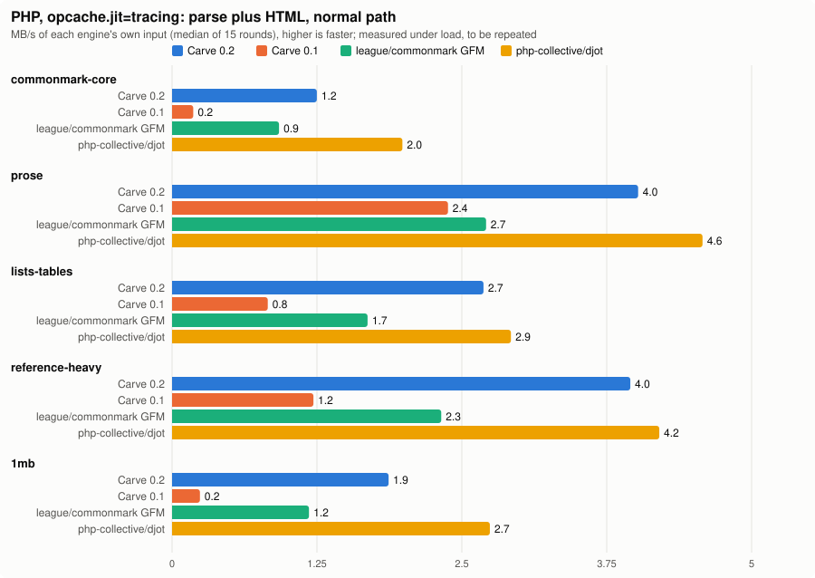
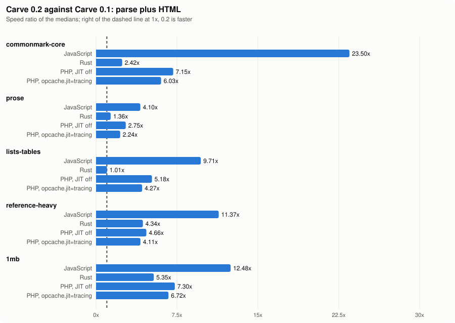

# carve-bench: Carve 0.2 on the normal path

This branch measures the three Carve 0.2 engines against their Carve 0.1 engines and against the
peers of their own language. Every engine takes the normal path: parse the source to the full
tree, then render HTML from that tree. The fast paths of the 0.1 engines, which write HTML without
building a tree, are not measured anywhere on this branch.

The numbers below are from a laptop with a desktop session open and no other jobs running (load
average 2 to 4 on 16 threads, given with the results).

## What is measured

| Language | Carve 0.2 | Carve 0.1, tree route | Peers (default configuration) |
|---|---|---|---|
| JavaScript | `parse(src)` and `render(src)` of carve-js `v2/src` | `resolve(parse(src))`, and `renderHtml(resolve(parse(src, { positions })))` | markdown-it, commonmark.js, djot.js |
| Rust | `carve2::parse_resolved` and `carve2::render` | `carve::parse`, and `carve::render_html(&carve::parse(src))` | pulldown-cmark, comrak, jotdown |
| PHP | `Carve2::parse` and `Carve2::toHtml` | `CarveConverter::parse`, and `render(parse(src))` | league/commonmark (GFM converter), php-collective/djot (`parse`, then `render`) |

Two measures per engine and document: **parse to tree** (source to the tree the engine renders
from) and **parse plus HTML**. Each is given in microseconds per document and in MB/s of the
engine's own input (1 MB = 10^6 bytes). The tables here show MB/s from the median; every median
and minimum in microseconds is in [`results/RESULTS.md`](results/RESULTS.md), every sample in the
JSON files next to it.

Documents (see [`documents/SOURCE.md`](documents/SOURCE.md)): the four document triples of carve-js
`next2`, each in Carve (`.crv`), Markdown (`.md`) and Djot (`.dj`) with the same content, and a
`1mb` document built from their concatenation. Each engine reads its own language.

## Not like for like: what each engine builds

The peers do not all do the same job, and the fastest ones do the least. Read every comparison with
this table next to it.

| Engine | What "parse" gives | Tree? |
|---|---|---|
| Carve 0.2, Carve 0.1 | a typed document tree with a source span on every block and inline node, then a resolve step (references, heading ids, footnote and caption numbers, sections) | yes |
| commonmark.js | a node tree | yes |
| djot.js | a node tree | yes |
| comrak | a node tree in an arena | yes |
| league/commonmark | a node tree | yes |
| php-collective/djot | a node tree | yes |
| markdown-it | a flat list of tokens; inline content hangs below block tokens | **no tree** |
| pulldown-cmark | a stream of events, pulled by the renderer | **no tree** |
| jotdown | a stream of events, pulled by the renderer | **no tree** |

What follows from it:

- **pulldown-cmark and jotdown are a different kind of program.** They never hold the document.
  Their HTML is written while the source is read, which is what the fast paths of Carve 0.1 did and
  what this branch leaves out for Carve. Their "parse to tree" number here is the event stream
  collected into a list, so that there is a number at all. Part of their lead over Carve 0.2 (2.4x
  to 13x) is the tree they do not build; this benchmark cannot say how large that part is. No tree
  also means no formatter, no linter with positions, no round trip and nothing for other tools to
  work on. They are in the tables as a ceiling, marked "(no tree)".
- **The like-for-like peers are the ones with a tree:** commonmark.js and djot.js in JavaScript,
  comrak in Rust, league/commonmark and php-collective/djot in PHP.
- **Even those do less per node.** Carve 0.2 keeps a source span on every node, inline nodes
  included, keeps the facts a writer needs to give the source back, and runs a resolve step before
  it renders. The CommonMark engines also read a smaller language in their default configuration
  (no attributes, no footnotes, no captions or cross-references; tables only where the engine has
  them on). This benchmark does not try to equalize that; it says so here instead.

## How the 0.1 fast paths are avoided

- **JavaScript.** `carveToHtml` first tries `tryFastHtml`, then `tryFastAstDocument` and an internal
  HTML-only parse. The benchmark calls the public `parse`, `resolve` and `renderHtml` instead, none
  of which reaches those functions. For the HTML measure, positions are on only when the source
  holds an image, the rule `carveToHtml` itself applies; the parse measure uses the default
  (positions on), as Carve 0.2's `parse` does.
- **Rust.** `carve::to_html` first tries `try_layout_html`. The benchmark calls `carve::parse` and
  then `carve::render_html(&doc)`, which takes only the tree and has no source to lay out from.
- **PHP.** `CarveConverter::convert` first tries the borrowed HTML layout and hands the source to
  the renderer. The benchmark calls `parse` and then `render($document)`; `render` alone has no
  source, so the renderer takes its tree route.

Each harness proves the route on the input `# Title\n\nHello *world*.\n`, which the JavaScript and
PHP fast paths serve (checked through their internal planners): it parses, edits the first text
node of the tree, renders again, and records that the edit shows in the HTML and that the unedited
HTML equals the engine's one-call output. The records are the `route` fields of the result files.

## Results

<!-- results:start -->

Measured 2026-11-15T22:51:04.961Z to 2026-11-15T23:05:50.391Z on AMD Ryzen 9 PRO 7940HS w/ Radeon 780M Graphics (16 threads), Linux 7.0.0-38-generic. v22.22.2, PHP 8.5.12, rustc 1.97.1 (8bab26f4f 2026-07-14). Harness commit `39fb1470262b11b2053404000a3513ec83edca02`. Engine commits: carve-js `0b4e3be9cb0ea1db6c04d9ba04ba09a8436ded7b`, carve-rs `bfd28e6ca6b9ad3d756cee0b35ba6bf458a161a5`, carve-php `a9679962657af56f1b743ba7a1910e279fb935a5`. Load average at start 2.82, 2.49, 2.92, at end 2.14, 2.7, 3.06.

### Parse plus HTML, normal path

| JavaScript: parse plus HTML, MB/s | commonmark-core | prose | lists-tables | reference-heavy | 1mb |
|---|--:|--:|--:|--:|--:|
| Carve 0.2 | 14.9 | 33.3 | 21.4 | 26.6 | 14.8 |
| Carve 0.1 | 0.6 | 8.1 | 2.2 | 2.3 | 1.2 |
| markdown-it (token list) | 7.2 | 17.9 | 12.1 | 14.8 | 8.1 |
| commonmark.js | 16.2 | 46.5 | 36.7 | 36.8 | 11.7 |
| djot.js | 6.1 | 22.6 | 13.3 | 19.2 | 8.3 |

| Rust: parse plus HTML, MB/s | commonmark-core | prose | lists-tables | reference-heavy | 1mb |
|---|--:|--:|--:|--:|--:|
| Carve 0.2 | 19.2 | 45.5 | 29.3 | 38.6 | 12.8 |
| Carve 0.1 | 7.9 | 33.6 | 29.0 | 8.9 | 2.4 |
| pulldown-cmark (no tree) | 130.2 | 263.4 | 231.4 | 218.0 | 161.5 |
| comrak | 50.4 | 107.5 | 89.7 | 90.3 | 32.6 |
| jotdown (no tree) | 52.8 | 110.3 | 83.9 | 99.1 | 65.9 |

| PHP, JIT off: parse plus HTML, MB/s | commonmark-core | prose | lists-tables | reference-heavy | 1mb |
|---|--:|--:|--:|--:|--:|
| Carve 0.2 | 2.2 | 7.9 | 5.4 | 7.4 | 2.6 |
| Carve 0.1 | 0.3 | 2.9 | 1.0 | 1.6 | 0.4 |
| league/commonmark GFM | 1.2 | 3.4 | 2.5 | 3.4 | 1.6 |
| php-collective/djot | 2.9 | 6.3 | 4.7 | 6.0 | 3.9 |

| PHP, opcache.jit=tracing: parse plus HTML, MB/s | commonmark-core | prose | lists-tables | reference-heavy | 1mb |
|---|--:|--:|--:|--:|--:|
| Carve 0.2 | 2.2 | 7.9 | 5.3 | 7.2 | 2.5 |
| Carve 0.1 | 0.4 | 3.5 | 1.2 | 1.8 | 0.4 |
| league/commonmark GFM | 1.2 | 3.6 | 2.4 | 3.3 | 1.6 |
| php-collective/djot | 2.9 | 6.0 | 4.3 | 5.7 | 3.9 |

### Parse to tree

| JavaScript: parse to tree, MB/s | commonmark-core | prose | lists-tables | reference-heavy | 1mb |
|---|--:|--:|--:|--:|--:|
| Carve 0.2 | 14.2 | 31.2 | 21.2 | 26.9 | 14.9 |
| Carve 0.1 | 0.7 | 8.6 | 1.7 | 2.5 | 1.3 |
| markdown-it (token list) | 8.1 | 18.8 | 13.3 | 16.0 | 8.7 |
| commonmark.js | 25.5 | 67.4 | 51.3 | 51.7 | 18.6 |
| djot.js | 7.6 | 25.4 | 14.5 | 21.6 | 9.8 |

| Rust: parse to tree, MB/s | commonmark-core | prose | lists-tables | reference-heavy | 1mb |
|---|--:|--:|--:|--:|--:|
| Carve 0.2 | 25.7 | 57.8 | 39.7 | 53.3 | 17.4 |
| Carve 0.1 | 8.9 | 41.6 | 38.2 | 11.2 | 3.0 |
| pulldown-cmark (no tree) | 128.7 | 297.1 | 258.4 | 241.3 | 156.1 |
| comrak | 63.4 | 140.1 | 113.1 | 108.0 | 46.6 |
| jotdown (no tree) | 57.4 | 127.9 | 96.1 | 124.4 | 73.3 |

| PHP, JIT off: parse to tree, MB/s | commonmark-core | prose | lists-tables | reference-heavy | 1mb |
|---|--:|--:|--:|--:|--:|
| Carve 0.2 | 2.6 | 9.2 | 6.4 | 9.0 | 3.9 |
| Carve 0.1 | 0.3 | 5.3 | 1.5 | 2.0 | 0.6 |
| league/commonmark GFM | 1.5 | 4.1 | 2.9 | 3.8 | 2.2 |
| php-collective/djot | 2.8 | 7.7 | 5.3 | 7.5 | 5.1 |

| PHP, opcache.jit=tracing: parse to tree, MB/s | commonmark-core | prose | lists-tables | reference-heavy | 1mb |
|---|--:|--:|--:|--:|--:|
| Carve 0.2 | 2.5 | 9.0 | 6.3 | 8.8 | 3.8 |
| Carve 0.1 | 0.4 | 5.9 | 1.7 | 2.5 | 0.7 |
| league/commonmark GFM | 1.5 | 4.4 | 3.0 | 3.8 | 2.2 |
| php-collective/djot | 4.3 | 8.0 | 5.9 | 7.7 | 5.1 |

### Carve 0.2 against Carve 0.1 (speed ratio of the medians, above 1x means 0.2 is faster)

| Lane | Measure | commonmark-core | prose | lists-tables | reference-heavy | 1mb |
|---|---|--:|--:|--:|--:|--:|
| JavaScript | parse to tree | 21.36x | 3.63x | 12.72x | 10.64x | 11.31x |
| JavaScript | parse plus HTML | 23.50x | 4.10x | 9.71x | 11.37x | 12.48x |
| Rust | parse to tree | 2.88x | 1.39x | 1.04x | 4.76x | 5.84x |
| Rust | parse plus HTML | 2.42x | 1.36x | 1.01x | 4.34x | 5.35x |
| PHP, JIT off | parse to tree | 8.04x | 1.74x | 4.38x | 4.42x | 6.71x |
| PHP, JIT off | parse plus HTML | 7.15x | 2.75x | 5.18x | 4.66x | 7.30x |
| PHP, opcache.jit=tracing | parse to tree | 6.33x | 1.52x | 3.65x | 3.56x | 5.54x |
| PHP, opcache.jit=tracing | parse plus HTML | 6.03x | 2.24x | 4.27x | 4.11x | 6.72x |

### Element counts of the 0.1 and the 0.2 HTML of the `.crv` documents

| JavaScript: document | p 0.1 / 0.2 | li 0.1 / 0.2 | h1-h6 0.1 / 0.2 | a 0.1 / 0.2 | td/th 0.1 / 0.2 | code 0.1 / 0.2 | Within 1% |
|---|--:|--:|--:|--:|--:|--:|---|
| commonmark-core | 600 / 450 | 600 / 600 | 151 / 151 | 300 / 300 | 0 / 0 | 300 / 300 | **does not agree** (largest difference 25.0%) |
| prose | 55 / 55 | 0 / 0 | 20 / 20 | 109 / 109 | 0 / 0 | 118 / 118 | agrees (largest difference 0.0%) |
| lists-tables | 34 / 34 | 96 / 96 | 19 / 19 | 59 / 59 | 86 / 86 | 81 / 81 | agrees (largest difference 0.0%) |
| reference-heavy | 53 / 53 | 30 / 30 | 16 / 16 | 154 / 154 | 0 / 0 | 41 / 41 | agrees (largest difference 0.0%) |
| 1mb | 6438 / 5088 | 6294 / 6294 | 1854 / 1854 | 5422 / 5422 | 774 / 774 | 4748 / 4748 | **does not agree** (largest difference 21.0%) |

| Rust: document | p 0.1 / 0.2 | li 0.1 / 0.2 | h1-h6 0.1 / 0.2 | a 0.1 / 0.2 | td/th 0.1 / 0.2 | code 0.1 / 0.2 | Within 1% |
|---|--:|--:|--:|--:|--:|--:|---|
| commonmark-core | 600 / 450 | 600 / 600 | 151 / 151 | 300 / 300 | 0 / 0 | 300 / 300 | **does not agree** (largest difference 25.0%) |
| prose | 55 / 55 | 0 / 0 | 20 / 20 | 109 / 109 | 0 / 0 | 118 / 118 | agrees (largest difference 0.0%) |
| lists-tables | 34 / 34 | 96 / 96 | 19 / 19 | 59 / 59 | 86 / 86 | 81 / 81 | agrees (largest difference 0.0%) |
| reference-heavy | 53 / 53 | 30 / 30 | 16 / 16 | 154 / 154 | 0 / 0 | 41 / 41 | agrees (largest difference 0.0%) |
| 1mb | 6438 / 5088 | 6294 / 6294 | 1854 / 1854 | 5422 / 5422 | 774 / 774 | 4748 / 4748 | **does not agree** (largest difference 21.0%) |

| PHP, JIT off: document | p 0.1 / 0.2 | li 0.1 / 0.2 | h1-h6 0.1 / 0.2 | a 0.1 / 0.2 | td/th 0.1 / 0.2 | code 0.1 / 0.2 | Within 1% |
|---|--:|--:|--:|--:|--:|--:|---|
| commonmark-core | 600 / 450 | 600 / 600 | 151 / 151 | 300 / 300 | 0 / 0 | 300 / 300 | **does not agree** (largest difference 25.0%) |
| prose | 55 / 55 | 0 / 0 | 20 / 20 | 109 / 109 | 0 / 0 | 118 / 118 | agrees (largest difference 0.0%) |
| lists-tables | 34 / 34 | 96 / 96 | 19 / 19 | 59 / 59 | 86 / 86 | 81 / 81 | agrees (largest difference 0.0%) |
| reference-heavy | 53 / 53 | 30 / 30 | 16 / 16 | 154 / 154 | 0 / 0 | 41 / 41 | agrees (largest difference 0.0%) |
| 1mb | 6438 / 5088 | 6294 / 6294 | 1854 / 1854 | 5422 / 5422 | 774 / 774 | 4748 / 4748 | **does not agree** (largest difference 21.0%) |

<!-- results:end -->

### Reading the results (run of 2026-11-15)

- **JavaScript.** Carve 0.2 is faster than Carve 0.1 on every document, 3.6x to 24x. It is faster
  than markdown-it (which builds no tree) and djot.js everywhere. commonmark.js parses faster than Carve 0.2 on every
  document, and is faster to HTML on four of five (Carve 0.2 leads on `1mb`); commonmark.js reads
  no tables or footnotes.
- **Rust.** Carve 0.2 is faster than Carve 0.1 on `commonmark-core` (2.4x), `reference-heavy`
  (4.3x) and `1mb` (5.4x) for parse plus HTML, a little faster on `prose` (1.4x), and **level on
  `lists-tables` (1.01x)**. The goal "clearly faster than 0.1 on the normal path" is not met in
  Rust on `lists-tables`. Of the peers, only comrak builds a tree: it is about 2.5x faster than
  Carve 0.2. pulldown-cmark (6x to 13x) and jotdown (2.4x to 5x) build none.
- **PHP.** Carve 0.2 is faster than Carve 0.1 everywhere, least on `prose` (1.5x to 2.8x). The
  tracing JIT makes no difference for Carve 0.2. Carve 0.2 is faster than league/commonmark
  everywhere. Against php-collective/djot it is faster on `prose`, `lists-tables` and
  `reference-heavy` and slower on `commonmark-core` and `1mb`, for both measures.
- **The 0.2 engines against each other.** Rust is 1.3x to 1.5x faster than JavaScript on four
  documents, and JavaScript is faster on `1mb` (14.8 MB/s against 12.8 MB/s). PHP is 4x to 9x
  slower than both.
- **Context for the large JavaScript ratios.** Carve 0.1's public tree route is much slower than
  its fast path: a spot check on `commonmark-core` gave about 4 ms for `carveToHtml` and 50 to 75
  ms for `parse` plus `renderHtml`. Carve 0.2's normal path (about 5 ms) is therefore faster than
  0.1's tree route but not faster than 0.1's fast path on that document. Fast paths are outside this
  benchmark; this is a single unrepeated measurement.

## Charts








## Method

The same in all three languages:

- One process per language (PHP: one process with the JIT off, one with `opcache.jit=tracing`),
  run one after another.
- Engines are built once, outside the timed loop, with their default options.
- Each cell (engine, document, measure) is warmed up with one loop of at least 200 ms, then
  measured for 15 rounds. In a round every cell runs a timed loop of at least 200 ms; the order of
  the cells rotates from round to round so that drift hits every engine alike. The median and the
  minimum of the 15 rounds are reported.
- Before every timed loop the garbage collector runs once, untimed (PHP `gc_collect_cycles()`, Node
  `gc()` through `--expose-gc`), so that garbage one cell leaves behind is not collected inside the
  loop of another. A first run without it gave league/commonmark cells a median up to seven times
  their minimum.
- Every output is kept or read (string lengths and node counts go into a sink that is written to
  the result file), so no engine can skip work.
- Rust: release build with the release profile of carve-rs (`lto = "thin"`, `codegen-units = 1`).
- PHP: CLI with `-n` and only `ctype`, `mbstring`, `intl`, `dom` and `tokenizer` loaded (no pcov, no
  xdebug: the harness refuses to run with either), opcache on for the CLI, measured with
  `opcache.jit=disable` and with `opcache.jit=tracing`.
- Node: the installed version.
- The run records versions, the commit of every engine and of this harness, the CPU model and the
  load average at the start and end of the run and of every lane (`results/environment.json` and
  the `load` field of each lane file).

Engines are pinned by commit in [`pins.json`](pins.json); `scripts/fetch.mjs` checks them out into
`.engines/` (not committed) and builds the 0.1 JavaScript engine. The 0.1 engines are the code
outside `v2/` at the same commit. The peers are pinned by the lock files in `engines/`.

## Rerun

Needs git, Node 22 or later, PHP 8.2 or later with Composer, and Rust.

```sh
npm run bench            # fetch, build, measure, rewrite results/, charts/ and the tables above
npm run bench:quick      # 2 short rounds into build/quick, to check that everything runs
npm run report           # tables and charts again from the committed results
```

A full run takes about 20 minutes. Set `CARGO_TARGET_DIR` to reuse a Rust build directory.

## Caveats

- **One run on a laptop.** A desktop session was open (load average 2 to 4 on 16 threads). An
  earlier run under heavy load gave the same order of engines with lower numbers throughout; the
  ratios between engines measured in the same round move less than the absolute numbers.
- **The 0.1 and 0.2 HTML do not agree on `commonmark-core`** (and so on `1mb`, which contains it):
  0.1 renders its lists as loose lists with a `<p>` in each item and `---` as `<hr>`, 0.2 renders
  tight items and a paragraph. 600 against 450 paragraphs, 25%. The other element counts agree
  exactly. The speed numbers of these two documents compare engines that do not produce the same
  HTML.
- **Three peers build no tree** (pulldown-cmark, jotdown, markdown-it): see "Not like for like" above.
- **Peers run in their default configuration.** comrak and pulldown-cmark then read the GFM tables
  and footnotes of the `.md` documents as paragraphs, commonmark.js too, so on `lists-tables` and
  `reference-heavy` they do less work than the engines that support those. markdown-it's default
  preset has tables but no footnotes. league/commonmark runs its GFM converter (tables, no
  footnotes). The main branch enabled tables in comrak and pulldown-cmark; this branch does not.
- **marked is not measured**: the main branch does not measure it.
- **league/commonmark is 2.10.7**, not the 2.10.0 of the main branch: Composer refuses 2.10.0
  because of two security advisories.
- **Carve 0.1 in Rust** is built with its default features, which include the experimental event
  parser that `carve::parse` tries first. It returns the same full tree.
- **The Carve 0.1 versions are the code outside `v2/` at the pinned `next2` commits** (carve-js
  0.1.17, carve-rs 0.1.14, carve-php after 0.1.17), not the published 0.1 releases.

## What this branch removed

Everything of the 0.1 benchmark: the fast-path, borrowed-route and PHP tier rows and harnesses, the
tier and history reports, `reports/`, the comparison and feature documents, the 0.1 corpus and
charts, the HTML import comparison, and the benchmark site with its Pages workflow (it is fed by
the 0.1 history files; rebuilding it on the new result files was not done). The 0.1 workflows are
replaced by `check`, which measures nothing: it checks the scripts and that the committed tables and
charts follow from the committed results.
