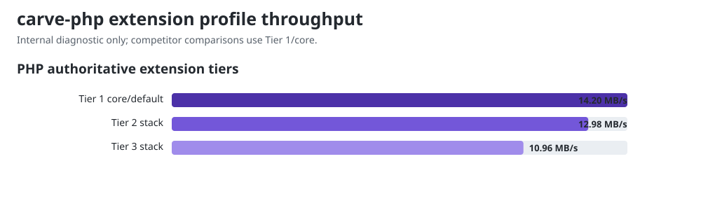

# Benchmark results: authoritative/full parser

This is **Track B**, the Carve-owned authoritative/full-parser view. The mixed
corpus falls outside the conservative borrowed facades and therefore exercises
normal AST construction, extension-capable parsing, and rendering. It answers
how the three Carve implementations scale on their full language—not how their
fastest core-only convenience API compares with another library.

For **Track A**, the fastest public Tier-1 source-to-HTML comparison against
same-language libraries, see [`COMPARISON.md`](./COMPARISON.md).

Parse + render to HTML, in-process, averaged over many iterations. Lower
ms/op and higher MB/s are better. `rel` is relative to the fastest engine for
that document (1.00x = fastest). Numbers are machine-specific - run it yourself
with `node run.mjs`; see README for setup.

**Run:** 2026-08-20 on Linux 7.0 x86_64, AMD Ryzen 9 PRO 7940HS (8C/16T), Node.js 22.22.2, PHP 8.5.9 NTS tracing JIT, rustc 1.97.1. The run was pinned to logical CPU 15.

**Engine heads:** carve-js `e4ca018b`, carve-php `3592b1e2`, carve-rs `52c9fe35`.

**Corpus snapshot:** carve `d909dcf0` (1,325 documents).

## small (1.2 KB)

| Engine | ms/op | MB/s | rel |
|---|---:|---:|---:|
| carve-js | 1.4769 | 0.80 | 11.62x |
| carve-php | 1.9068 | 0.62 | 15.00x |
| carve-rs | 0.1271 | 9.25 | 1.00x |

## medium (40.2 KB)

| Engine | ms/op | MB/s | rel |
|---|---:|---:|---:|
| carve-js | 54.2456 | 0.72 | 5.47x |
| carve-php | 179.1832 | 0.22 | 18.07x |
| carve-rs | 9.9180 | 3.96 | 1.00x |

## large (321.4 KB)

| Engine | ms/op | MB/s | rel |
|---|---:|---:|---:|
| carve-js | 461.1391 | 0.68 | 5.80x |
| carve-php | 1848.9070 | 0.17 | 23.25x |
| carve-rs | 79.5384 | 3.95 | 1.00x |

## PHP authoritative extension tiers

These are internal Carve measurements over the same core document. Tier 1 is
the default public conversion route and therefore takes the conservative fast
facade; registering an extension selects the authoritative AST path. Tier 2
and Tier 3 quantify configured/full-parser cost and are not competitor rows.

| Profile | Registered extensions | ms/op | MB/s | cost vs Tier 1 |
|---|---:|---:|---:|---:|
| Tier 1 core/default | 0 | 3.42 | 13.74 | baseline |
| Tier 2 stack | 8 | 59.04 | 0.80 | +1,627% |
| Tier 3 stack | 20 | 85.92 | 0.55 | +2,413% |

The exact extension bundles and interpretation are documented in
[`FINDINGS.md`](./FINDINGS.md#extension-tier-cost). There is no normative Tier
3 profile; it is a reproducible internal stress stack.

## Why Track B has no competitor rows

The 1,325-document corpus uses Carve syntax and capabilities that the peer
libraries do not accept equivalently. Feeding it to Djot/CommonMark parsers
would benchmark error recovery or literal-text handling, not the same work.
Track A therefore uses equivalent native-language fixtures for competitors,
while Track B and the tier table remain honest Carve-internal architecture
measurements.
