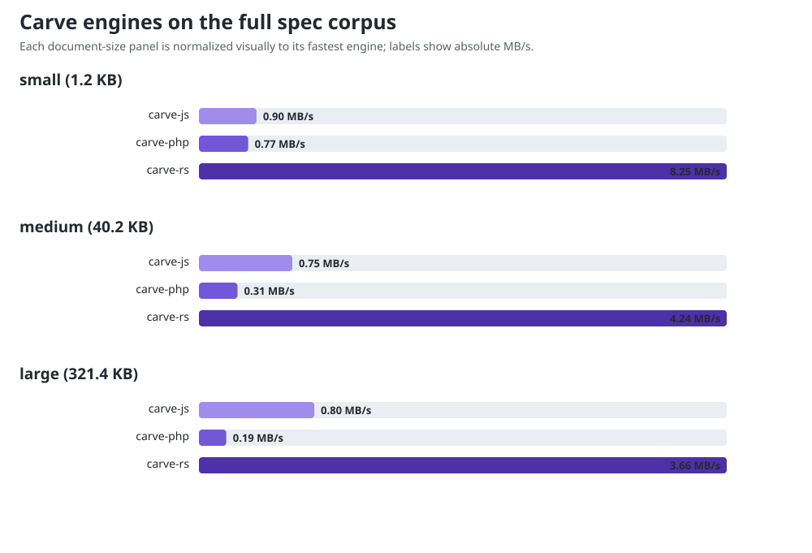

# Benchmark results

Parse + render to HTML, in-process, averaged over many iterations. Lower
ms/op and higher MB/s are better. `rel` is relative to the fastest engine for
that document (1.00x = fastest). Numbers are machine-specific - run it yourself
with `node run.mjs`; see README for setup.

**Run:** 2026-08-19 on Linux 7.0 x86_64, AMD Ryzen 9 PRO 7940HS (8C/16T),
Node.js 22.22.2, PHP 8.5.9 NTS, rustc 1.97.1. PHP used CLI opcache with tracing
JIT; pcov was excluded from the scanned INI directory and every PHP result
reported `jit=true`.

**Engine heads:** carve-js `a1810781`, carve-php `70f08e27`, carve-rs
`f753909f`. The corpus was regenerated from carve `d4e90cfd` (1,301 documents).
The increased medium/large sizes make absolute comparison with the previous
snapshot invalid; compare throughput and current-engine ratios instead.

## small (1.2 KB)

| Engine | ms/op | MB/s | rel |
|---|---:|---:|---:|
| carve-js | 1.0979 | 1.07 | 4.68x |
| carve-php | 2.8904 | 0.41 | 12.33x |
| carve-rs | 0.2345 | 5.01 | 1.00x |

## medium (40.2 KB)

| Engine | ms/op | MB/s | rel |
|---|---:|---:|---:|
| carve-js | 40.8531 | 0.96 | 4.18x |
| carve-php | 173.0306 | 0.23 | 17.72x |
| carve-rs | 9.7642 | 4.02 | 1.00x |

## large (321.4 KB)

| Engine | ms/op | MB/s | rel |
|---|---:|---:|---:|
| carve-js | 341.8881 | 0.92 | 3.41x |
| carve-php | 2035.6362 | 0.15 | 20.32x |
| carve-rs | 100.1985 | 3.13 | 1.00x |
