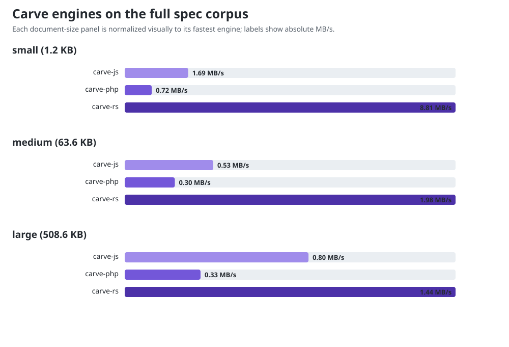
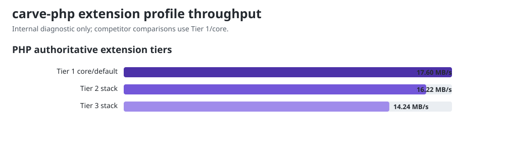

# Benchmark results: authoritative/full parser

This is **Track B**, the Carve-owned authoritative/full-parser view. The mixed
corpus falls outside the conservative borrowed facades and therefore exercises
normal AST construction, extension-capable parsing, and rendering. It answers
how the three Carve implementations scale on their full language, not how their
fastest core-only convenience API compares with another library.

For **Track A**, the primary core source-to-HTML comparison against the
same-language libraries, see [`COMPARISON.md`](./COMPARISON.md).

Parse + render to HTML, in-process, averaged over many iterations. Lower
ms/op and higher MB/s are better. `rel` is relative to the fastest engine for
that document (1.00x = fastest). Numbers are machine-specific - run it yourself
with `node run.mjs`; see README for setup.

**Run:** 2026-09-30 Europe/Berlin; Node 24.19.0, PHP 8.5.11 tracing JIT, rustc 1.97.1; 16 logical CPUs, local shared host. Full-corpus rerun; timings do not establish a speed change. Small-input timings are unstable.

**Engines measured:** carve-js `@markup-carve/carve 0.1.9 (local checkout /tmp/carve-js-perf-20260930 @ 6d02fa706)`, carve-php `markup-carve/carve-php (local checkout /tmp/carve-php-perf-20260930 @ 7033d04b1)`, carve-rs `carve-lang 0.1.7 (local checkout /tmp/carve-rs-perf-20260930 @ 9f3f334c7)`

**Corpus snapshot:** carve `9db91206d1a4a8a8cf795c48210bca49d66f14d6` (2,134 documents); byte-exact regeneration verified.

## small (1.2 KB)

Small-input timings are unstable. Read the [recorded diagnostic](reports/performance-refresh.md#small-input-diagnostic) before comparing small-document speed.

| Engine | ms/op | MB/s | rel |
|---|---:|---:|---:|
| carve-js | 2.3572 | 0.50 | 13.38x |
| carve-php | 4.3822 | 0.27 | 24.87x |
| carve-rs | 0.1762 | 6.68 | 1.00x |

## medium (63.6 KB)

| Engine | ms/op | MB/s | rel |
|---|---:|---:|---:|
| carve-js | 56.9590 | 1.09 | 3.76x |
| carve-php | 139.8118 | 0.44 | 9.24x |
| carve-rs | 15.1353 | 4.10 | 1.00x |

## large (508.6 KB)

| Engine | ms/op | MB/s | rel |
|---|---:|---:|---:|
| carve-js | 439.0450 | 1.13 | 3.09x |
| carve-php | 1264.6116 | 0.39 | 8.89x |
| carve-rs | 142.2185 | 3.49 | 1.00x |

## PHP authoritative extension tiers

These are internal Carve measurements over the same core document, measured
by this run rather than transcribed. Tier 1 is the default public conversion
route; Tier 2 and Tier 3 register opt-in extensions on top of it. Since
carve-php #1515 made configured conversion allocation-light, registering an
extension no longer forces a wholly separate slow path, so these rows read as
registration and hook costs on a document whose content does not trigger
the registered extensions. Shared host noise can affect ratios, including
apparent negative overhead. These are internal diagnostics, not competitor rows.

| Profile | Registered extensions | ms/op | MB/s | cost vs Tier 1 |
|---|---:|---:|---:|---:|
| Tier 1 core/default | 0 | 3.97 | 11.85 | baseline |
| Tier 2 stack | 8 | 4.21 | 11.17 | +6% |
| Tier 3 stack | 20 | 5.11 | 9.20 | +29% |

The exact extension bundles and interpretation are documented in
[`FINDINGS.md`](./FINDINGS.md#extension-tier-cost). There is no normative Tier
3 profile; it is a reproducible internal stress stack.

## Why Track B has no competitor rows

The corpus uses Carve syntax and capabilities that peer libraries do not
accept equivalently. Feeding it to Djot/CommonMark parsers would benchmark
literal/error recovery rather than the same work. Track A therefore uses
equivalent native-language fixtures for competitors.
