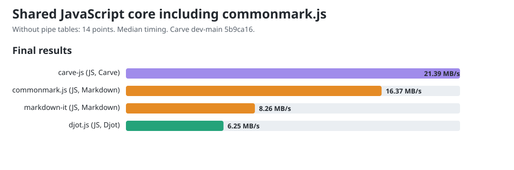

# JavaScript core comparison including commonmark.js

Allowed CPUs: 13. Child processes inherit this affinity, including Node compiler and GC threads. Measured 2026-10-07T11:02:30.922Z, Node v22.22.2, AMD Ryzen 9 PRO 7940HS w/ Radeon 780M Graphics, 16 logical CPUs. Benchmark harness checkout: `37db57fe9693193149d42dd07faf231770138af4`; cached remote main: `b4f8e1e130dbae0036c7b8d3a17f9320e93c1e63`; dirty tracked tree: true. Harness hashes are recorded in the JSON.

Carve JS merged main 0.1.10 at `5b9ca1632e179418944bc869ddd4dbc4165f9485`; fast path verified. Released peers: Djot 0.3.2, markdown-it 15.0.0, commonmark.js 0.31.2.

This shared workload excludes pipe tables, which commonmark.js does not support. All four libraries receive 150 equivalent sections in native syntax. The 14 exercised points are the existing 18-point rubric without its three table-grid points and one alignment point. These measurements form a separate lane from [the comparison with pipe tables](dev-main-core-pre-final-audit-20261007.md); their throughput values must not be mixed.

Before timing, all engines agree under an HTML projection that ignores section wrappers, generated IDs, list paragraph wrappers and non-code whitespace formatting. It preserves element hierarchy, emphasis versus strong, resolved link destinations, code language and code bytes. This is scoped workload verification, not general language conformance.

## Final chart values

The charts and site show one final value per engine: throughput computed from median timing across all trial samples from both measurement rounds. The diagnostic round tables below show each round's fastest trial.

| Engine | Median ms/op | MB/s |
|---|---:|---:|
| carve-js | 2.2172 | 21.39 |
| djot.js | 7.5942 | 6.25 |
| markdown-it | 5.8126 | 8.26 |
| commonmark.js | 2.9321 | 16.37 |



## Reused public conversion APIs

| Engine | Bytes | Round 1 fastest MB/s | Round 2 fastest MB/s |
|---|---:|---:|---:|
| carve-js | 49732 | 21.54 | 22.09 |
| djot.js | 49732 | 6.82 | 6.69 |
| markdown-it | 50332 | 8.36 | 8.33 |
| commonmark.js | 50332 | 16.82 | 16.73 |

## CommonMark constructor control

| API lifetime | Round 1 fastest ms/op | Round 2 fastest ms/op |
|---|---:|---:|
| Reuse parser and renderer | 2.8537 | 2.8690 |
| Construct both per call | 2.5975 | 2.6387 |

The lifetime control investigates the parser-construction concern in [djot.js #13](https://github.com/jgm/djot.js/issues/13). markdown-it also reuses its instance; Carve and Djot use their public conversion functions. These are default API costs, not equal object lifetimes. The table records both lifetimes; it does not isolate constructor cost from runtime optimization.

One-minute host load was 2.51 at start and 2.04 at end. Timings are observations on this host; the reversed rounds retain order variation. No universal speed ranking is established.

## Reproduce

Use Node v22.22.2 for this snapshot.

```sh
cd engines/js
npm ci
cd ../..
git clone https://github.com/markup-carve/carve-js.git /tmp/carve-js-main
git -C /tmp/carve-js-main checkout 5b9ca1632e179418944bc869ddd4dbc4165f9485
npm ci --prefix /tmp/carve-js-main
taskset -c 13 node scripts/compare-commonmark.mjs --carve-main /tmp/carve-js-main --carve-revision 5b9ca1632e179418944bc869ddd4dbc4165f9485
node scripts/gen-charts.mjs
```

The [previous released snapshot](commonmark-js-release-0.1.9.md) preserves Carve JS 0.1.9 measurements and samples.

The [raw record](commonmark-js-pre-final-audit-20261007.json) retains all trial samples, both rounds, source/output hashes, workload controls, exact package versions and harness hashes.
