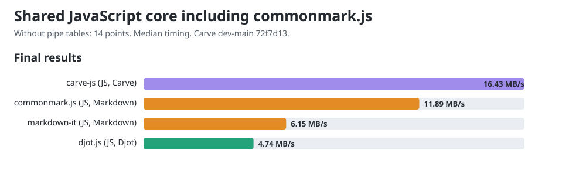

# JavaScript core comparison including commonmark.js

Allowed CPUs: 13. Child processes inherit this affinity, including Node compiler and GC threads. Measured 2026-10-07T22:26:08.471Z, Node v22.22.2, AMD Ryzen 9 PRO 7940HS w/ Radeon 780M Graphics, 16 logical CPUs. Benchmark harness checkout: `a4553ecdc352668ab057eb0d2fa3a979a66decdc`; cached remote main: `9b742aca7d2a73251fd74f9f4bbb880beffe2d8b`; dirty tracked tree: true. Harness hashes are recorded in the JSON.

Carve JS merged main 0.1.10 at `72f7d1333bf4a271a7371b62c6c599d280412e68`; fast path verified. Released peers: Djot 0.3.2, markdown-it 15.0.0, commonmark.js 0.31.2.

This shared workload excludes pipe tables, which commonmark.js does not support. All four libraries receive 150 equivalent sections in native syntax. The 14 exercised points are the existing 18-point rubric without its three table-grid points and one alignment point. These measurements form a separate lane from [the comparison with pipe tables](dev-main-core.md); their throughput values must not be mixed.

Before timing, all engines agree under an HTML projection that ignores section wrappers, generated IDs, list paragraph wrappers and non-code whitespace formatting. It preserves element hierarchy, emphasis versus strong, resolved link destinations, code language and code bytes. This is scoped workload verification, not general language conformance.

## Final chart values

The charts and site show one final value per engine: throughput computed from median timing across all trial samples from both measurement rounds. The diagnostic round tables below show each round's fastest trial.

| Engine | Median ms/op | MB/s |
|---|---:|---:|
| carve-js | 2.8866 | 16.43 |
| djot.js | 9.9993 | 4.74 |
| markdown-it | 7.8043 | 6.15 |
| commonmark.js | 4.0362 | 11.89 |



## Reused public conversion APIs

| Engine | Bytes | Round 1 fastest MB/s | Round 2 fastest MB/s |
|---|---:|---:|---:|
| carve-js | 49732 | 17.35 | 16.45 |
| djot.js | 49732 | 5.00 | 5.21 |
| markdown-it | 50332 | 6.31 | 6.18 |
| commonmark.js | 50332 | 13.14 | 12.66 |

## CommonMark constructor control

| API lifetime | Round 1 fastest ms/op | Round 2 fastest ms/op |
|---|---:|---:|
| Reuse parser and renderer | 3.6538 | 3.7909 |
| Construct both per call | 3.4286 | 3.5608 |

The lifetime control investigates the parser-construction concern in [djot.js #13](https://github.com/jgm/djot.js/issues/13). markdown-it also reuses its instance; Carve and Djot use their public conversion functions. These are default API costs, not equal object lifetimes. The table records both lifetimes; it does not isolate constructor cost from runtime optimization.

One-minute host load was 5.55 at start and 5.95 at end. Timings are observations on this host; the reversed rounds retain order variation. No universal speed ranking is established.

## Reproduce

Use Node v22.22.2 for this snapshot.

```sh
cd engines/js
npm ci
cd ../..
git clone https://github.com/markup-carve/carve-js.git /tmp/carve-js-main
git -C /tmp/carve-js-main checkout 72f7d1333bf4a271a7371b62c6c599d280412e68
npm ci --prefix /tmp/carve-js-main
taskset -c 13 node scripts/compare-commonmark.mjs --carve-main /tmp/carve-js-main --carve-revision 72f7d1333bf4a271a7371b62c6c599d280412e68
node scripts/gen-charts.mjs
```

The [previous released snapshot](commonmark-js-release-0.1.9.md) preserves Carve JS 0.1.9 measurements and samples.

The [raw record](commonmark-js-pre-table-import-20261008.json) retains all trial samples, both rounds, source/output hashes, workload controls, exact package versions and harness hashes.

The measured source pins were frozen at the start of this refresh. Later include fixes merged during the run and were not measured. All current core, corpus, paired controls and history reports retain the same frozen pins. The core report records newer heads observed at repeat setup; earlier workloads retain their own measurement-time provenance.
