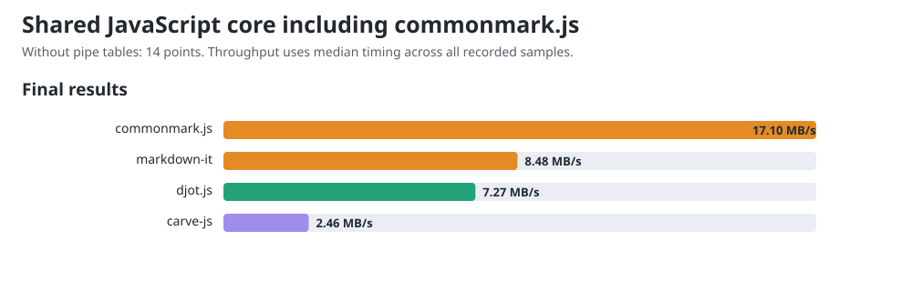

# JavaScript core comparison including commonmark.js

Measured 2026-10-02T14:07:55.356Z, Node v24.19.0, AMD Ryzen 9 PRO 7940HS w/ Radeon 780M Graphics, 16 logical CPUs. Benchmark main at setup: `906361bae52cccf52c9e4ae728f3bab8dc8c94d2`.

Released packages: Carve JS 0.1.9, Djot 0.3.2, markdown-it 15.0.0, commonmark.js 0.31.2.

This shared workload excludes pipe tables, which commonmark.js does not support. All four libraries receive 150 equivalent sections in native syntax. The 14 exercised points are the existing 18-point rubric without its three table-grid points and one alignment point. These measurements form a separate lane from [the comparison with pipe tables](../COMPARISON.md); their throughput values must not be mixed.

Before timing, all engines agree under an HTML projection that ignores section wrappers, generated IDs, list paragraph wrappers and non-code whitespace formatting. It preserves element hierarchy, emphasis versus strong, resolved link destinations, code language and code bytes. This is scoped workload verification, not general language conformance.

## Final chart values

The charts and site show one final value per engine: throughput computed from median timing across all trial samples from both measurement rounds. The diagnostic round tables below show each round's fastest trial.

| Engine | Median ms/op | MB/s |
|---|---:|---:|
| carve-js | 19.2870 | 2.46 |
| djot.js | 6.5233 | 7.27 |
| markdown-it | 5.6582 | 8.48 |
| commonmark.js | 2.8064 | 17.10 |



## Reused public conversion APIs

| Engine | Bytes | Round 1 fastest MB/s | Round 2 fastest MB/s |
|---|---:|---:|---:|
| carve-js | 49732 | 2.54 | 2.50 |
| djot.js | 49732 | 8.47 | 6.93 |
| markdown-it | 50332 | 9.24 | 8.72 |
| commonmark.js | 50332 | 19.51 | 17.59 |

## CommonMark constructor control

| API lifetime | Round 1 fastest ms/op | Round 2 fastest ms/op |
|---|---:|---:|
| Reuse parser and renderer | 2.4603 | 2.7292 |
| Construct both per call | 2.2767 | 2.3118 |

The lifetime control investigates the parser-construction concern in [djot.js #13](https://github.com/jgm/djot.js/issues/13). markdown-it also reuses its instance; Carve and Djot use their public conversion functions. These are default API costs, not equal object lifetimes. Round variation makes the constructor-cost comparison inconclusive.

One-minute host load was 3.04 at start and 3.68 at end. Timings are observations on this host; the reversed rounds retain order variation. No universal speed ranking is established.

## Reproduce

```sh
cd engines/js
npm ci
cd ../..
node scripts/compare-commonmark.mjs
node scripts/gen-charts.mjs
```

The [raw record](commonmark-js-release-0.1.9.json) retains all trial samples, both rounds, source/output hashes, workload controls, exact package versions and harness hashes.

This is an archived registry-package run. Use the benchmark harness at commit
`6046e810ec2ce50ba529112de21daf79ed70bd27` to repeat the original runner and
fixture. Current reproduction commands can measure newer development sources.
