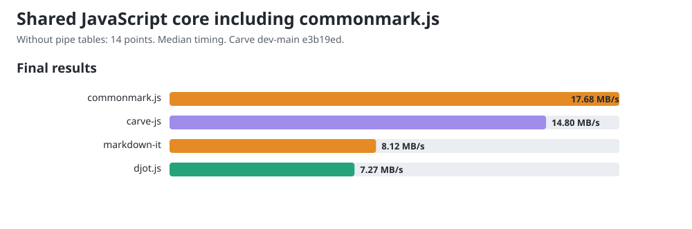

# JavaScript core comparison including commonmark.js

Allowed CPUs: 0, 1, 2, 3, 4, 5, 6, 7, 8, 9, 10, 11, 12, 13, 14, 15. Child processes inherit this affinity, including Node compiler and GC threads. Measured 2026-10-04T03:07:41.206Z, Node v22.22.2, AMD Ryzen 9 PRO 7940HS w/ Radeon 780M Graphics, 16 logical CPUs. Benchmark main at setup: `57b60fcc7df67087c66a4f76e8b1acf6397dcfa3`.

Carve JS merged main 0.1.10 at `604c2223de4a2bfe6133adcc8cce9ac5a8ba0391`; fast path verified. Released peers: Djot 0.3.2, markdown-it 15.0.0, commonmark.js 0.31.2.

This shared workload excludes pipe tables, which commonmark.js does not support. All four libraries receive 150 equivalent sections in native syntax. The 14 exercised points are the existing 18-point rubric without its three table-grid points and one alignment point. These measurements form a separate lane from [the comparison with pipe tables](../COMPARISON.md); their throughput values must not be mixed.

Before timing, all engines agree under an HTML projection that ignores section wrappers, generated IDs, list paragraph wrappers and non-code whitespace formatting. It preserves element hierarchy, emphasis versus strong, resolved link destinations, code language and code bytes. This is scoped workload verification, not general language conformance.

## Final chart values

The charts and site show one final value per engine: throughput computed from median timing across all trial samples from both measurement rounds. The diagnostic round tables below show each round's fastest trial.

| Engine | Median ms/op | MB/s |
|---|---:|---:|
| carve-js | 2.2203 | 21.36 |
| djot.js | 6.0598 | 7.83 |
| markdown-it | 6.0080 | 7.99 |
| commonmark.js | 2.9194 | 16.44 |



## Reused public conversion APIs

| Engine | Bytes | Round 1 fastest MB/s | Round 2 fastest MB/s |
|---|---:|---:|---:|
| carve-js | 49732 | 21.94 | 21.58 |
| djot.js | 49732 | 7.96 | 7.83 |
| markdown-it | 50332 | 8.51 | 7.86 |
| commonmark.js | 50332 | 16.65 | 16.75 |

## CommonMark constructor control

| API lifetime | Round 1 fastest ms/op | Round 2 fastest ms/op |
|---|---:|---:|
| Reuse parser and renderer | 2.8826 | 2.8662 |
| Construct both per call | 2.5710 | 2.6565 |

The lifetime control investigates the parser-construction concern in [djot.js #13](https://github.com/jgm/djot.js/issues/13). markdown-it also reuses its instance; Carve and Djot use their public conversion functions. These are default API costs, not equal object lifetimes. The table records both lifetimes; it does not isolate constructor cost from runtime optimization.

One-minute host load was 1.18 at start and 1.85 at end. Timings are observations on this host; the reversed rounds retain order variation. No universal speed ranking is established.

## Reproduce

Use Node v22.22.2 for this snapshot.

```sh
cd engines/js
npm ci
cd ../..
git clone https://github.com/markup-carve/carve-js.git /tmp/carve-js-main
git -C /tmp/carve-js-main checkout 604c2223de4a2bfe6133adcc8cce9ac5a8ba0391
npm ci --prefix /tmp/carve-js-main
node scripts/compare-commonmark.mjs --carve-main /tmp/carve-js-main --carve-revision 604c2223de4a2bfe6133adcc8cce9ac5a8ba0391
node scripts/gen-charts.mjs
```

The [previous released snapshot](commonmark-js-release-0.1.9.md) preserves Carve JS 0.1.9 measurements and samples.

The [raw record](commonmark-js.json) retains all trial samples, both rounds, source/output hashes, workload controls, exact package versions and harness hashes.
