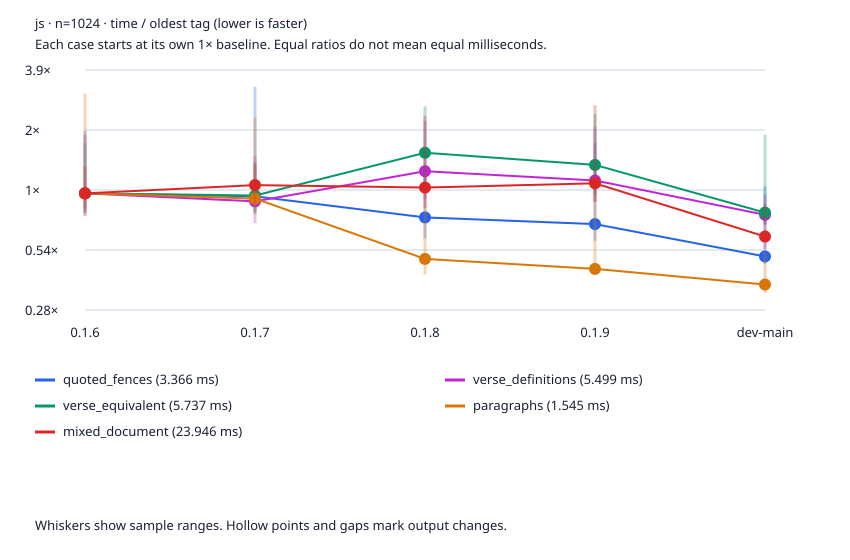
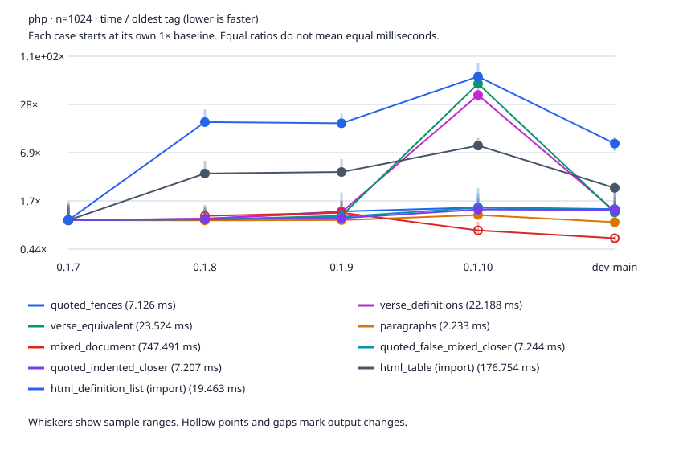
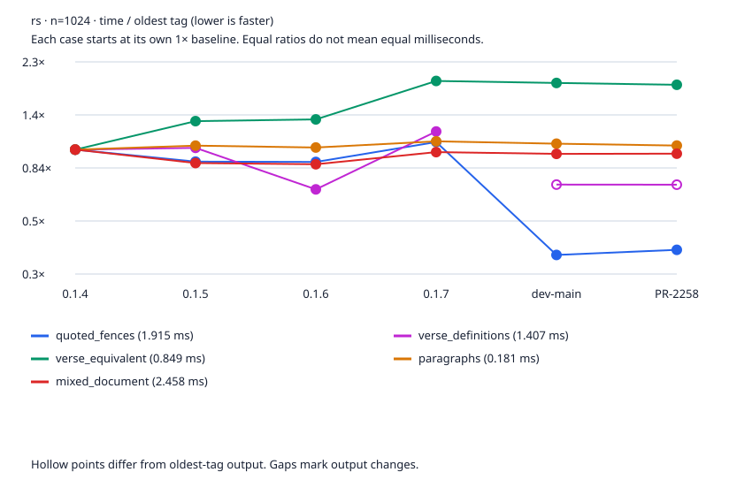

# Engine release history

Sessions began 2026-10-02T12:21:26.895588+00:00. 4 stable tags per engine plus a pinned dev-main when measured source differs from the newest tag.

Median elapsed milliseconds; lower is faster. Each revision uses the same fixtures; runtime versions are recorded for each engine and revision. Samples exclude process startup. Node warms each workload for at least 500 ms and a minimum iteration count. Rust uses an optimized release build; PHP has CLI opcache/JIT and coverage disabled. These settings differ from the headline benchmark, so compare revisions within this history rather than mixing report numbers.

The host is shared. CPU affinity does not reserve a core. Raw samples, minimum/maximum times, load averages, source fingerprints, runtime versions and worker hashes are in the JSON. A changed output hash means the timing is for different work. Each case has its own oldest-tag baseline of 1×; equal starting ratios do not mean equal milliseconds. The legend lists those baseline times. Graphs use a logarithmic time ratio and connect points only when their output hashes agree.

[Interactive history](engine-history.html) · [Raw JSON](engine-history.json) · [CSV](engine-history.csv)

## Measurement sessions

Release-tag measurements retain their original sessions. All three merged main points were refreshed on October 4, 2026 with the same fixtures, workers, sampling counts and CPU affinity. Main and tags were measured in separate sessions on a shared host; differences do not isolate code changes.

js retained measurements: driver `70fe1de88f1b7e9705c65d831d2e3bcf4cc9d537`, session started 2026-10-02T12:21:26.895588+00:00, CPU affinity [12]; dirty benchmark tree: False.

php retained measurements: driver `70fe1de88f1b7e9705c65d831d2e3bcf4cc9d537`, session started 2026-10-02T12:21:26.895588+00:00, CPU affinity [12]; dirty benchmark tree: False.

rs retained measurements: driver `70fe1de88f1b7e9705c65d831d2e3bcf4cc9d537`, session started 2026-10-02T12:21:26.895588+00:00, CPU affinity [12]; dirty benchmark tree: False.

js dev-main refresh: 2026-10-04T13:22:08.948371+00:00 to 2026-10-04T13:22:35.409054+00:00. [Point provenance](engine-history.json).

php dev-main refresh: 2026-10-04T13:22:08.948371+00:00 to 2026-10-04T13:24:09.251968+00:00. [Point provenance](engine-history.json).

rs dev-main refresh: 2026-10-04T13:22:08.948371+00:00 to 2026-10-04T13:24:10.102882+00:00. [Point provenance](engine-history.json).

## Shared-host spread

Initial load average: [5.18994140625, 5.53466796875, 5.52490234375]. Final load average: [7.6640625, 8.294921875, 7.34130859375]. Whiskers show sample ranges; medians from noisy sessions are descriptive readings, not confirmed speed changes.

js: widest sample range is 12.9x for 0.1.8 verse_equivalent n=128 (0.748 to 9.631 ms). Inspect round medians in the JSON before attributing a difference to code.

php: widest sample range is 28.4x for dev-main paragraphs n=128 (0.195 to 5.532 ms). Inspect round medians in the JSON before attributing a difference to code.

rs: widest sample range is 7.2x for 0.1.6 verse_equivalent n=128 (0.115 to 0.829 ms). Inspect round medians in the JSON before attributing a difference to code.

## Watchpoints

- php dev-main html_definition_list n=128: 16.762 ms versus 2.418 ms on 0.1.7 (+593.2%). Output hashes match and sample ranges are separate; investigate this older-baseline cost.
- php dev-main html_table n=1024: 427.531 ms versus 176.754 ms on 0.1.7 (+141.9%). Output hashes match and sample ranges are separate; investigate this older-baseline cost.
- php dev-main html_definition_list n=1024: 162.076 ms versus 19.463 ms on 0.1.7 (+732.7%). Output hashes match and sample ranges are separate; investigate this older-baseline cost.

## js

Runtime: v22.22.2. Latest tag: 0.1.9.

| Revision | Commit |
|---|---|
| 0.1.6 | `379474fbc87a9afe36620e2b71902f88d2b757b5` |
| 0.1.7 | `680af386605367bb86a07c2b258673c6514c4005` |
| 0.1.8 | `23204e8982012a4b3900dc735e46b3c2630803c2` |
| 0.1.9 | `a0cb0ad18fc4da223e46cfb77672e4dec537a83b` |
| dev-main | `05778b2f76c650df71567ebb149938ce8612e9d2` |

| Point | Case | n | Latest tag ms | Point ms | vs tag | Main ms | vs main | Same output as tag | Tag range ms | Point range ms |
|---|---|---:|---:|---:|---:|---:|---:|:---:|---:|---:|
| dev-main | quoted_fences | 128 | 0.311 | 0.241 | -22.3% | 0.241 | +0.0% | yes | 0.254 to 1.718 | 0.224 to 0.966 |
| dev-main | verse_definitions | 128 | 0.744 | 0.627 | -15.6% | 0.627 | +0.0% | yes | 0.656 to 2.999 | 0.580 to 0.992 |
| dev-main | verse_equivalent | 128 | 0.850 | 0.637 | -25.0% | 0.637 | +0.0% | yes | 0.686 to 1.712 | 0.601 to 4.100 |
| dev-main | paragraphs | 128 | 0.079 | 0.075 | -5.7% | 0.075 | +0.0% | yes | 0.075 to 0.101 | 0.068 to 0.090 |
| dev-main | mixed_document | 128 | 1.451 | 1.144 | -21.2% | 1.144 | +0.0% | yes | 1.217 to 2.254 | 1.106 to 2.037 |
| dev-main | quoted_fences | 1024 | 2.401 | 1.780 | -25.8% | 1.780 | +0.0% | yes | 1.997 to 5.849 | 1.633 to 2.460 |
| dev-main | verse_definitions | 1024 | 6.334 | 4.800 | -24.2% | 4.800 | +0.0% | yes | 5.014 to 11.435 | 3.983 to 6.466 |
| dev-main | verse_equivalent | 1024 | 7.843 | 5.132 | -34.6% | 5.132 | +0.0% | yes | 5.643 to 13.768 | 4.572 to 8.120 |
| dev-main | paragraphs | 1024 | 0.673 | 0.595 | -11.6% | 0.595 | +0.0% | yes | 0.634 to 1.763 | 0.553 to 1.790 |
| dev-main | mixed_document | 1024 | 26.744 | 16.823 | -37.1% | 16.823 | +0.0% | yes | 21.797 to 63.089 | 14.390 to 34.433 |

## php

Runtime: 8.5.11. Latest tag: 0.1.10.

| Revision | Commit |
|---|---|
| 0.1.7 | `9fd773b229d4d63b8b468b87b122943d563c80dc` |
| 0.1.8 | `93409af08040344221ff0d2d2d40351c8105e413` |
| 0.1.9 | `d4b53388df891158c9c868177a4213a5e8b2f608` |
| 0.1.10 | `6d94607eaa9d51c9ed782342161beca77b05aaf9` |
| dev-main | `03cb29aef26af2a933c8e70a90fe4f3c9a7fbf5d` |

The merged main point was refreshed on October 4, 2026. Release tags retain their original samples; cross-session differences do not establish code speedups.

| Point | Case | n | Latest tag ms | Point ms | vs tag | Main ms | vs main | Same output as tag | Tag range ms | Point range ms |
|---|---|---:|---:|---:|---:|---:|---:|:---:|---:|---:|
| dev-main | quoted_fences | 128 | 1.255 | 1.428 | +13.8% | 1.428 | +0.0% | yes | 1.187 to 1.458 | 1.332 to 3.758 |
| dev-main | verse_definitions | 128 | 17.196 | 3.720 | -78.4% | 3.720 | +0.0% | yes | 15.922 to 19.451 | 3.400 to 22.475 |
| dev-main | verse_equivalent | 128 | 24.120 | 3.858 | -84.0% | 3.858 | +0.0% | yes | 21.500 to 32.741 | 3.508 to 20.989 |
| dev-main | paragraphs | 128 | 0.337 | 0.199 | -40.9% | 0.199 | +0.0% | yes | 0.314 to 0.538 | 0.195 to 5.532 |
| dev-main | mixed_document | 128 | 4.114 | 2.915 | -29.2% | 2.915 | +0.0% | yes | 3.662 to 6.599 | 2.571 to 7.673 |
| dev-main | quoted_false_mixed_closer | 128 | 1.303 | 1.414 | +8.5% | 1.414 | +0.0% | yes | 1.208 to 2.339 | 1.324 to 5.060 |
| dev-main | quoted_indented_closer | 128 | 1.294 | 1.421 | +9.8% | 1.421 | +0.0% | yes | 1.190 to 2.059 | 1.336 to 3.565 |
| dev-main | html_table | 128 | 86.981 | 43.881 | -49.6% | 43.881 | +0.0% | yes | 74.461 to 143.771 | 38.957 to 109.897 |
| dev-main | html_definition_list | 128 | 44.049 | 16.762 | -61.9% | 16.762 | +0.0% | yes | 39.431 to 76.770 | 13.685 to 109.844 |
| dev-main | quoted_fences | 1024 | 10.285 | 10.520 | +2.3% | 10.520 | +0.0% | yes | 8.763 to 15.076 | 9.427 to 55.963 |
| dev-main | verse_definitions | 1024 | 800.499 | 30.602 | -96.2% | 30.602 | +0.0% | yes | 721.439 to 981.896 | 27.057 to 154.469 |
| dev-main | verse_equivalent | 1024 | 1174.312 | 31.829 | -97.3% | 31.829 | +0.0% | yes | 1069.473 to 1300.351 | 27.783 to 199.814 |
| dev-main | paragraphs | 1024 | 2.593 | 1.678 | -35.3% | 1.678 | +0.0% | yes | 2.510 to 3.375 | 1.543 to 3.412 |
| dev-main | mixed_document | 1024 | 557.954 | 476.399 | -14.6% | 476.399 | +0.0% | yes | 481.274 to 719.898 | 405.512 to 980.186 |
| dev-main | quoted_false_mixed_closer | 1024 | 10.379 | 10.461 | +0.8% | 10.461 | +0.0% | yes | 8.490 to 18.159 | 9.573 to 11.843 |
| dev-main | quoted_indented_closer | 1024 | 9.795 | 10.192 | +4.0% | 10.192 | +0.0% | yes | 8.413 to 13.812 | 9.510 to 12.199 |
| dev-main | html_table | 1024 | 1499.097 | 427.531 | -71.5% | 427.531 | +0.0% | yes | 1315.302 to 1868.470 | 393.694 to 631.317 |
| dev-main | html_definition_list | 1024 | 1190.962 | 162.076 | -86.4% | 162.076 | +0.0% | yes | 1064.362 to 1774.015 | 141.710 to 210.449 |

## rs

Runtime: rustc 1.97.1 (8bab26f4f 2026-07-14). Latest tag: 0.1.7.

| Revision | Commit |
|---|---|
| 0.1.4 | `2e9c43f22c5ed05dbd93323ae6b9c94bb867b285` |
| 0.1.5 | `56cb353657375e1a85965d5fcf00a234831d82c6` |
| 0.1.6 | `d7837249c64b88879b04cd71b8b5555ff246e16f` |
| 0.1.7 | `9f3f334c7d5c91c57e4e6269b32599af1062fdde` |
| dev-main | `47dfe714ec0c90da12b300b87934e07688745041` |

| Point | Case | n | Latest tag ms | Point ms | vs tag | Main ms | vs main | Same output as tag | Tag range ms | Point range ms |
|---|---|---:|---:|---:|---:|---:|---:|:---:|---:|---:|
| dev-main | quoted_fences | 128 | 0.101 | 0.075 | -25.2% | 0.075 | +0.0% | yes | 0.099 to 0.125 | 0.072 to 0.087 |
| dev-main | verse_definitions | 128 | 0.184 | 0.149 | n/a: different output | 0.149 | +0.0% | no | 0.176 to 0.231 | 0.131 to 0.207 |
| dev-main | verse_equivalent | 128 | 0.197 | 0.170 | -13.7% | 0.170 | +0.0% | yes | 0.181 to 0.311 | 0.161 to 0.214 |
| dev-main | paragraphs | 128 | 0.028 | 0.021 | -24.6% | 0.021 | +0.0% | yes | 0.026 to 0.044 | 0.020 to 0.029 |
| dev-main | mixed_document | 128 | 0.389 | 0.213 | -45.2% | 0.213 | +0.0% | yes | 0.296 to 0.504 | 0.209 to 0.254 |
| dev-main | quoted_fences | 1024 | 2.208 | 0.653 | -70.4% | 0.653 | +0.0% | yes | 2.070 to 2.663 | 0.511 to 2.078 |
| dev-main | verse_definitions | 1024 | 1.821 | 1.370 | n/a: different output | 1.370 | +0.0% | no | 1.730 to 3.594 | 1.345 to 1.434 |
| dev-main | verse_equivalent | 1024 | 1.788 | 1.511 | -15.5% | 1.511 | +0.0% | yes | 1.354 to 3.493 | 1.457 to 1.622 |
| dev-main | paragraphs | 1024 | 0.218 | 0.162 | -25.5% | 0.162 | +0.0% | yes | 0.199 to 0.391 | 0.153 to 1.092 |
| dev-main | mixed_document | 1024 | 2.649 | 1.816 | -31.4% | 1.816 | +0.0% | yes | 2.552 to 4.102 | 1.713 to 3.288 |

